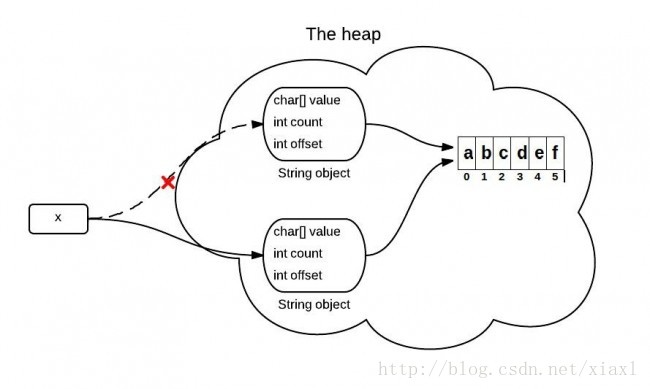
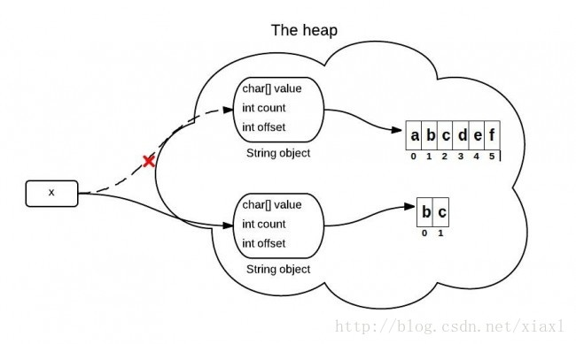

# 一、对象

## 1.1.创建对象的方式

```java
import java.io.Serializable;  
  
public class Worker implements Cloneable,Serializable {  
  
    private static final long serialVersionUID = 1L;  
    private String name;  
    private int age;  
      
    public Worker()  {  
        this.name = "";  
        this.age = 0;  
    }  
      
    public Worker(String name,int age)  {  
        this.name = name;  
        this.age = age;  
    }  
      
    public void work()  {  
        System.out.println(name +"is working");  
    }  
      
    public Worker clone()  {  
        Worker worker = null;  
        try {  
            return (Worker) super.clone();  
        } catch (CloneNotSupportedException e) {  
            // TODO Auto-generated catch block  
            e.printStackTrace();  
        }  
        return worker;  
    }  
} 
```

## 1.1.直接使用无参构造 

```java
/* 
 * 方式1： 直接使用new的方式,不使用参数 
 */  
public static Worker createWorker() {  
    return new Worker();  
} 
```

## 1.2.使用有参构造

```java
/* 
 * 方式2： 使用new方式，带参数 
 */  
public static Worker createWorker(String name, int age) {  
    return new Worker(name, age);  
} 
```

## 1.3.使用反射机制的newInstance

```java
/* 
 * 方式3： 使用反射机制，不带参数 Class 對象的 newInstance() 方法 
 */  
public static Worker createWorker1() {  
    Class clazz = null;  
    Worker worker = null;  
    try {  
        clazz = Class.forName("com.lou.creation.Worker");  
        worker = (Worker) clazz.newInstance();  
    } catch (Exception e) {  
        e.printStackTrace();  
    } 
    return worker;  
}
```

## 1.4.使用反射机制constructor

```java
/* 
 * 方式4： 使用反射机制 ， Constructor的 newInstance方法 
 */  
public static Worker createWorker2() {  
    Worker worker = null;  
    try {  
        Class clazz = null;  
        clazz = Class.forName("com.lou.creation.Worker");  

        // 获取不带参数的构造器  
        Constructor constructor = clazz.getConstructor();  
        // 使用构造器创建对象  
        worker = (Worker) constructor.newInstance();  

    } catch (Exception e) {  
        e.printStackTrace();  
    } 
    return worker;  
} 
```

```java
 /* 
  * 方式5： 使用反射机制 ：带参数的构造函数创建新对象 
  */  
public static Worker createWorker3(String name, Integer age) {  
    Worker worker = null;  
    try {  
        Class clazz = null;  
        clazz = Class.forName("com.lou.creation.Worker");  

        // 获取不带参数的构造器  
        Constructor constructor = clazz.getConstructor(name.getClass(),age.getClass());  
        // 使用构造器创建对象  
        worker = (Worker) constructor.newInstance(name, age);  

    } catch (Exception e) {  
        e.printStackTrace();  
    } 
    return worker;  
}  
```

## 1.5.使用序列化和反序列化

```java
/* 
 * 方式6： 使用序列化和反序列化创建对象，这种方式其实是根据既有的对象进行复制，这个需要事先将可序列化的对象线存到文件里 
 */  
@SuppressWarnings("resource")  
public static Worker createWorker4(String objectPath) {  
    ObjectInput input = null;  
    Worker worker = null;  
    try {  
        input = new ObjectInputStream(new FileInputStream(objectPath));  
        worker = (Worker) input.readObject();  
    } catch (Exception e) {  
        e.printStackTrace();  
    } 
    return worker;  
}  
```

## 1.6.对象写入文件

```java
/* 
 * 将创建的对象存入到文件内 
 */  
public static void storeObject2File(String objectPath) {  
    Worker worker = new Worker();  
    ObjectOutputStream objectOutputStream;  
    try {  
        objectOutputStream = new ObjectOutputStream(new FileOutputStream(  
            objectPath));  
        objectOutputStream.writeObject(worker);  
    } catch (Exception e) {  
        e.printStackTrace();  
    } 
}  
```

## 1.7.克隆

```java
/* 
 * 方式7， 使用对象的深复制进行复制，创建对象 
 */  
public static Worker createWorker5(Worker worker) {  
    return (Worker) worker.clone();  
}  
```

# 二、读取属性文件（Properties）

`ResourceBundle`和`Properties`都能读取属性文件，它们的区别：

* `Properties`继承于`Hashtable`，是基于输入流从属性文件中读取键值对，`load()`加载资源完毕后，就与输入流脱离了关系，但是不会自动关闭输入流，需手动关闭；
* `ResourceBundle`是基于类读取属性文件，即将属性文件当作类，因此属性文件必须放在包中，使用属性文件的全限定类名指定文件的位置；
* 属性文件采用`ISO-8859-1`编码方式，该编码方式不支持中文，中文字符将被转化为`Unicode`编码方式显示；

```java
public final class Configuration {

    private static final String CONFIG_FILE = "db";
    private static ResourceBundle rb;

    //使构造方法外部不能实例化
    private Configuration() {
        rb = ResourceBundle.getBundle(CONFIG_FILE);
    }

    public static Configuration getInstance() {
        return ConfigurationEnmu.INSTANCE.getInstance();
    }

    public String getValue(String key) {
        return rb.getString(key);
    }

    private static enum ConfigurationEnmu {
        INSTANCE;
        private Configuration configuration;

        //枚举类的构造方法，会在类加载时实例化
        ConfigurationEnmu() {
            configuration = new Configuration();
        }

        public Configuration getInstance() {
            return configuration;
        }
    }

}
```

# 三、内部类

内部类在编译完成后也会产生`.class`文件，文件名称：`外部类名称$内部类名称.class`。

## 3.1.匿名内部类

匿名内部类是没有名称的内部类。

- 匿名内部类不能定义任何静态成员和方法；
- 匿名内部类的方法不能抽象；
- 匿名内部类必须实现接口或继承父类的所有抽象方法；
- 匿名内部类不能定义构造方法；
- 当匿名内部类与外部类有同名变量（方法）时，默认方法匿名内部类的变量（方法），访问外部类的变量（方法）则需要加上外部类的类名；
- 匿名内部类可以访问外部类私有变量和方法，但是访问的外部类成员变量或成员方法必须用`static`修饰；

```java
public static int num = 100;

@Test
public void test07() {
    int num = 0; //外部类方法中的局部变量，此时匿名内部类中不能访问到
    Runnable runnable = new Runnable() {
        @Override
        public void run() {
            int num = 10;
            System.out.println(num);  //10，默认访问匿名内部类中的变量
            System.out.println(ThreadTest.num); //100，访问外部类的变量
        }
    };
    Thread thread = new Thread(runnable);
    thread.start();
}
```

在匿名内部类中使用局部变量时，在JDK1.7之前，局部变量需要`final`修饰；而在JDK1.7之后可省略，会默认添加；Lambda表达式中同理

```java
final int num = 0;
//匿名内部函数
Runnable runnable = new Runnable() {
    @Override
    public void run() {
        System.out.println("Runnable" + num);
    }
};

//Lambda
Runnable r = () -> System.out.println("Lambda" + num);
```

## 3.2.成员内部类/实例内部类


## 3.3.静态内部类


## 3.4.局部内部类


## 3.5.内部类的优缺点

### 3.5.1.优点

- 可以实现多重继承；
- 内部类可以很好的实现隐藏：一般的非内部类，是不允许有private与protected权限的，但内部类可以；
- 减少了类文件编译后的产生的字节码文件的大小

### 3.5.2.缺点

- 使程序结构不清楚


# 四、集合

## 4.1.`list`中`add()`与`addAll()`的区别

- `add(E e)`添加一个元素

```java
List<String> arr = Arrays.asList("aaa", "bbb", "ccc");
ArrayList<Object> list = new ArrayList<>();
list.add(12);
list.add(13);
list.add(arr);
System.out.println(list); //[12, 13, [aaa, bbb, ccc]]\
```

- `addAll(Collection<? extends E> c)`将集合中的每个元素添加到集合

```java
List<String> arr = Arrays.asList("aaa", "bbb", "ccc");
ArrayList<Object> list = new ArrayList<>();
list.add(12);
list.add(13);
list.addAll(arr);
System.out.println(list); //[12, 13, aaa, bbb, ccc]
```

## 4.2.`Map`如何判断key的唯一性


## 4.3.禁止`foreach`循环里进行元素的`remove/add`操作

```java
//正确写法
List<String> list = new ArrayList<String>() {{
    add("Hello");
    add("hello");
    add("HollisChuang");
    add("H");
}};
for (int i = 0; i < list.size(); i++) {
    String str = list.get(i);
    if ("hello".equals(str)) {
        list.remove(str);
    }
}
System.out.println(list);
```

```java
//正确写法
List<String> list = new ArrayList<String>() {{
    add("Hello");
    add("hello");
    add("HelloWorld");
    add("H");
}};
Iterator<String> iterator = list.iterator();
while (iterator.hasNext()){
    String next = iterator.next();
    if("HelloWorld".equals(next)){
        iterator.remove();
    }
}
System.out.println(list);
```

```java
//错误写法
List<String> list = new ArrayList<String>() {{
    add("Hollis");
    add("hollis");
    add("HollisChuang");
    add("H");
}};
for (String str : list) {
    if ("hollis".equals(str)) {
        list.remove(str);//remove()只修改了modCount的值，没有修改expectedModCount
    }
}
System.out.println(list);
```

此时会抛出`java.util.ConcurrentModificationException`异常，出现这个异常是因为触发了一个Java集合的错误检测机制——`fail-fast`(快速失败，它是Java集合的一种错误检测机制，当多个线程对集合（非fail-safe的集合类）进行结构上的改变的操作时，可能触发该机制；单线程违反了规则，也可能触发该机制)，原理：

- 增强for循环是Java的一个语法糖，编译后的源码

```java
Iterator iterator = userNames.iterator();
do{
    if(!iterator.hasNext())
        break;
    String userName = (String)iterator.next(); //此处抛出异常，在调用checkForComodification()时
    if(userName.equals("Hollis"))
        userNames.remove(userName);
} while(true);
System.out.println(userNames);
```

```java
final void checkForComodification() {
    //modCount是ArrayList中的一个成员变量，表示该集合实际被修改的次数
    //expectedModCount是ArrayList中的一个内部类Itr(Itr是一个Iterator的实现,ArrayList.iterator()方法可以获取到的迭代器就是Itr类的实例)中的成员变量，表示这个迭代器期望该集合被修改的次数，在ArrayList.iterator方法被调用的时候初始化的，且只有通过迭代器对集合进行操作，该值才会改变
    if (modCount != expectedModCount)
        throw new ConcurrentModificationException();
}
```

## 4.4.`Quene`


# 五、关键字

## 5.1.`instanceof`

`instanceof`判断运行时的对象是否是特定类的一个实例

```java
obj instanceof class
```

* 若`obj`是`class`的一个实例且`obj != null`，则返回`true`
* 若`obj`不是`class`的一个实例或`obj == null`，则返回`false`

### 5.1.1.`instanceof`在编译状态和运行状态的区别

> 编译状态

class可以是obj对象的父类、自身类、子类，都能通过编译

> 运行状态

class是obj对象的父类和自身类时返回true

## 5.2.`transient`


## 5.3.`volatile`


## 5.4.`synchronized`


# 六、JSON数据的处理

## 6.2.`Java`对象转`Json`

```java
import com.alibaba.fastjson.JSON;
import com.alibaba.fastjson.JSONObject;

User user = new User();
String json = JSONObject.toJSONString(user);
```

## 6.3.`Json`转`Java`对象

```java
import com.alibaba.fastjson.JSON;
import com.alibaba.fastjson.JSONObject;

User user = JSONObject.parseObject(json, User.class);
```

## 6.4.`Map`转`Json`

### 6.4.1.`json-lib`

```java
<dependency>
    <groupId>net.sf.json-lib</groupId>
    <artifactId>json-lib</artifactId>
    <version>2.4</version>
    <classifier>jdk15</classifier>
</dependency>
```

```java
JSONObject jsonObject = JSONObject.fromObject(map);
//json-lib是一个比较老的解决方案，近几年都没有升级过，它的适用环境是JDK1.5,在JDK1.6可能会报错，故需加上<classifier>jdk15</classifier>
```

### 6.4.2.`com.alibaba.fastjson.JSON`

```xml
<dependency>
    <groupId>com.alibaba</groupId>
    <artifactId>fastjson</artifactId>
    <version>1.2.41</version>
</dependency>
```

```java
JSONUtils.toJSONString(requestMap);
```

### 6.4.3.`gson`

```xml
<dependency>
    <groupId>com.google.code.gson</groupId>
    <artifactId>gson</artifactId>
    <version>2.3.1</version>
</dependency>
```

```java
new Gson().toJson(param);
```

### 6.4.4.`jackson`

```xml
jackson-core-2.6.0.jar
jackson-databind-2.6.0.jar
jackson-annotations-2.6.0.jar
```

```java
ObjectMapper mapper = new ObjectMapper();
json = mapper.writeValueAsString(map);
```

## 6.5.`Json`转`Map`

### 6.5.1.`com.alibaba.fastjson.JSON`

```xml
<dependency>
    <groupId>com.alibaba</groupId>
    <artifactId>fastjson</artifactId>
    <version>1.2.41</version>
</dependency>
```

```java
String str = "{\"0\":\"zhangsan\",\"1\":\"lisi\",\"2\":\"wangwu\",\"3\":\"maliu\"}";
//第一种方式
Map maps = (Map)JSON.parse(str);
//第二种方式
Map mapTypes = JSON.parseObject(str);
//第三种方式
Map mapType = JSON.parseObject(str,Map.class);
//第四种方式 JSONObject是Map接口的一个实现类
Map json = (Map) JSONObject.parse(str);
//第五种方式
JSONObject jsonObject = JSONObject.parseObject(str);
//第六种方式
Map mapObj = JSONObject.parseObject(str,Map.class);
```

### 6.5.2.`jackson`

```xml
jackson-core-2.6.0.jar
jackson-databind-2.6.0.jar
jackson-annotations-2.6.0.jar
```

```java
import com.fasterxml.jackson.core.type.TypeReference;
import com.fasterxml.jackson.databind.ObjectMapper;

String json = "{\"name\":\"zitong\", \"age\":\"26\"}";
ObjectMapper mapper = new ObjectMapper();
map = mapper.readValue(json, new TypeReference<HashMap<String,String>>(){});
```

## 6.6.`List`与`JSON`之间的转化

```java
import net.sf.json.JSONArray;
//list转成json
String json =JSONArray.fromObject(list).toString();

//json转成list
JSONArray jsonArray = JSONArray.fromObject(json);
List<String> list2 = (List) JSONArray.toCollection(jsonArray);
```

```java
//fastjson.jar
import com.alibaba.fastjson.JSON;
//list转json
String json = JSON.toJSON(list).toString();

//json转list
List<User> users= JSONObject.parseArray(json, User.class);
```

# 七、排序

## 7.1.`Comparable`

`Comparable`自然排序接口，若某个类实现了该接口，就意味该类支持排序（可以直接通过`Arrays.sort()`或 `Collections.sort()`进行排序）

```java
public class User implements Comparable<User> {
    private String userId;
    private String username;
    private int age;

    public User() {
    }

    public User(String userId, String username, int age) {
        this.userId = userId;
        this.username = username;
        this.age = age;
    }

    /**
     * 按年龄的从大到小的顺序排列
     * @param o
     * @return
     */
    @Override
    public int compareTo(@NotNull User o) {
        if(this.age > o.age){
            return 1;
        }else if(this.age < o.age){
            return -1;
        }else{
            return 0;
        }
        // 简写：return this.age - o.age;
    }
    
    ...
}
```

```java
@Test
public void test03(){
    User[] users = {new User("1","张三",30),new User("2","李四",14),new User("3","王五",20)};
    Arrays.sort(users);
    for (int i = 0; i < users.length; i++) {
        System.out.println(users[i]);
    }
}
```

```java
@Test
public void test04(){
    List list = new ArrayList();
    list.add(new User("1","张三",30));
    list.add(new User("2","李四",28));
    list.add(new User("3","王五",40));
    Collections.sort(list);
    System.out.println(list);
}
```

> 注意，null不是任何类的实例，即使e.equals(null)返回false，e.compareTo(null)也将抛出 NullPointerException。


## 7.2.`Comparator`

`Comparator`比较器接口，用于定制某个类排序，但是该类本身不支持排序

- 包括两个函数：compare()和equals()

```java
public class User implements Comparable<User> {
    private String userId;
    private String username;
    private int age;

    public User() {
    }

    public User(String userId, String username, int age) {
        this.userId = userId;
        this.username = username;
        this.age = age;
    }
}
```

```java
@Test
public void test05(){
    List list = new ArrayList();
    list.add(new User("1","张三",30));
    list.add(new User("2","李四",28));
    list.add(new User("3","王五",40));
    Collections.sort(list, new Comparator<User>() {
        @Override
        public int compare(User o1, User o2) {
            return o1.getAge() - o2.getAge();
        }
    });
    System.out.println(list);
}
```


# 八、类的加载

## 8.1.类的加载顺序

- 父类的静态代码（包含静态初始化代码块、静态属性，不包含静态方法，先声明的先执行）
- 子类的静态代码（包含静态初始化代码块、静态属性，不包含静态方法，先声明的先执行）
- 父类的非静态代码块（包含非静态初始化代码块，非静态属性，先声明的先执行）
- 父类的构造函数
- 子类的非静态代码块（包含非静态初始化代码块，非静态属性，先声明的先执行）
- 子类构造函数

```java
public class LoadSort {

    static {
        System.out.println("父类静态代码块");
    }

    {
        System.out.println("父类代码块");
    }

    public LoadSort() {
        System.out.println("父类构造方法");
    }
}
```

```java
public class LoadSortSub extends LoadSort {
    static {
        System.out.println("子类静态代码块");
    }

    {
        System.out.println("子类代码块");
    }

    public LoadSortSub() {
        System.out.println("子类构造方法");
    }
}
```

```java
父类静态代码块
子类静态代码块
父类代码块
父类构造方法
子类代码块
子类构造方法
```


# 九、字符串

## 1.1.`replaceFirst`、`replaceAll`、`replace`的区别

- `replace`没有使用正则表达式匹配，不是替换单个字符，会替换所有匹配的字符
- `replaceAll`、`replaceFirst`使用了正则表达式匹配

```java
String str = "my.txt.bak";
System.out.println(str.replace(".", "#"));//my#txt#bak
System.out.println(str.replaceAll("\\.", "#"));//my#txt#bak
System.out.println(str.replaceFirst("\\.", "#"));//my#txt.bak
//此处的.为正则表达式中的元字符，匹配任意一个字符
System.out.println(str.replaceAll(".", "#"));//##########
System.out.println(str.replaceFirst(".", "#"));//#y.txt.bak
```

## 1.2.`JDK6`与`JDK7`中`substrting()`的区别

`String`是通过字符数组实现的，在`jdk6`中`String`类包含三个成员变量：`char value[]， int offset，int count`。

- `JDK6`，调用`substring()`方法时，会创建一个新的`String`对象，但是该对象的值仍然指向原来的数组，只是

  `offset、count`的值不同

```java
String(int offset, int count, char value[]) {
    this.value = value;
    this.offset = offset;
    this.count = count;
}

public String substring(int beginIndex, int endIndex) {
    //check boundary
    return  new String(offset + beginIndex, endIndex - beginIndex, value);
}
```



- `JDK7`，调用`substring()`方法时，会堆内存中创建一个新的数组

```java
public String(char value[], int offset, int count) {
    //check boundary
    this.value = Arrays.copyOfRange(value, offset, offset + count);
}

public String substring(int beginIndex, int endIndex) {
    //check boundary
    int subLen = endIndex - beginIndex;
    return new String(value, beginIndex, subLen);
}
```



## 1.3.字符的拼接方式及区别

`String`是一个不可变的类，一旦被实例化就无法修改

```java
//String内部封装的是一个字符数组，final修饰不可修改
private final char value[];
```

1).使用`+`拼接，是Java的一个语法糖（），实现的原理是`StringBuilder.append()`

不建议在循环体内使用`+`拼接字符串，因为在循环中，每次都是`new`了一个`StringBuilder`，然后再把`String`转成`StringBuilder`，再进行`append`

```java
for (int i = 0; i < 50000; i++) {
   String s = String.valueOf(i);
   str += s;
}
```

```java
for(int i = 0; i < 50000; i++){
   String s = String.valueOf(i);
   str = (new StringBuilder()).append(str).append(s).toString();
}
```

2).使用`concat()`拼接

- `+`可以拼接字符串、数字和其它基本数据类型；`concat()`只能拼接字符串
- `+`左右可以是null；`concat()`左右为null时，会抛空指针

```java

public String concat(String str) {
   int otherLen = str.length();
   if (otherLen == 0) {
       return this;
   }
   int len = value.length;
   //创建一个字符数组（将就字符串复制到了数组），长度是旧字符串与待拼接字符串之和
   char buf[] = Arrays.copyOf(value, len + otherLen);
   //将待拼接字符串复制到数组
   str.getChars(buf, len);
   //将字符数组转化为字符串
   return new String(buf, true);
}
```

3).使用`StringBuilder`

```java
//StringBuilder内部封装的字符数组，但是可修改
char[] value;
```

4).`StringUtils.join()`和`String.join()`

```java
public void test08() {
    List list = new ArrayList<>();
    list.add("苹果");
    list.add("栗子");
    list.add("香蕉");
    String join = String.join(",", list);
    System.out.println(join);
    String str = StringUtils.join(list, ",");
    System.out.println(str);
}
```

> 效率：`StringBuilder < StringBuffer < concat < + < StringUtils.join`

>使用原则：
>
>1. 若只是简单的字符串拼接，可考虑使用`+`
>2. 若在`for`循环中进行字符串拼接，可考虑使用`StringBuilder`和`StringBuffer`
>3. 若是通过一个集合进行字符串拼接，可考虑使用`StringJoiner`
>4. 若是对一个数组镜像字符串拼接，可考虑将其转化为`Stream`，在使用`StringJoiner`处理

## 1.4.`String.valueOf()`与`Integer.toString()`

- 


## 1.5.`switch`

- `JDK7`以前`switch`中只支持`int`（`byte、short、char`及其对应的包装类型），但是`byte、short、char`会自动为`int`，
- `JDK7`以后支持`int、enum、boolean、String`
  - `jdk1.7`并没有新的指令来处理`switch string`，而是通过调用`switch`中`string.hashCode`，将`string`转换为`int`从而进行判断

## 1.6.字符串常量池、class常量池和运行时常量池

- 字符串常量池
- class常量池
- 运行时常量池


## 1.7.`StringJoiner`

`StringJoiner`构造由分隔符分隔的字符序列，并可选择性地从提供的前缀开始和以提供的后缀结尾

```java
StringJoiner sj = new StringJoiner(",");
sj.add("Apple");
sj.add("Banana");
sj.add("Hello");
System.out.println(sj.toString());//Apple,Banana,Hello
```

```java
StringJoiner joiner = new StringJoiner(",", "<", ">");
joiner.add("Spring");
joiner.add("MySQL");
joiner.add("Oracle");
joiner.add("SpringBoot");
System.out.println(joiner.toString());//<Spring,MySQL,Oracle,SpringBoot>
```

```java
StringJoiner stringJoiner = new StringJoiner(";");
stringJoiner.add("Spring");
stringJoiner.add("MySQL");
String str = "JSP";
//判断值不为空
stringJoiner.setEmptyValue(str);
stringJoiner.add(str);
stringJoiner.merge(joiner);
System.out.println(stringJoiner.toString());//Spring;MySQL;JSP;Spring,MySQL,Oracle,SpringBoot
```

```java
List<String> list = Arrays.asList("Hollis", "hollischuang", "Java干货");
String collect = list.stream().collect(Collectors.joining(":"));
System.out.println(collect);//Hollis:hollischuang:Java干货
```

`StringJoiner`是通过`StringBuilder`实现，故性能`StringBuilder`差不多，且是非线程安全的

# 十、枚举


# 十一、运算符

## 11.1.位移运算符

- `>>`:右移，若数值为正，高位补`0`；若数值为负，高位补`1`

```java
//正数，高位补0
System.out.println(20 >> 2); // 20/2^2 = 5
System.out.println(Integer.toBinaryString(20));     //10100
System.out.println(Integer.toBinaryString(20 >> 2));//00101
```

```java
//负数，高位补1
System.out.println(-20 >> 2); // -20/2^2 = -5
System.out.println(Integer.toBinaryString(-20));       //11111111111111111111111111101100
System.out.println(Integer.toBinaryString(-20 >> 2));  //11111111111111111111111111111011
```

```java
-20 的二进制原码 ：1001 0100
-20 的二进制反码 ：1110 1011
-20 的二进制补码 ：1110 1100 
右移两位后的补码 ：1111 1011 
            反码：1111 1010
            原码：1000 0101
            结果：r = -5
```

- `>>>`:**无符号右移，也叫逻辑右移**，忽略符号位，空位都以0补齐
  - 若数值为正，高位补`0`；
  - 若数值为负，高位补`0`；

```java
//正数，高位补0
System.out.println(20 >>> 2); // 20/2^2 = 5
System.out.println(Integer.toBinaryString(20));     //10100
System.out.println(Integer.toBinaryString(20 >>> 2));//00101
```

```java
//负数，高位补0
System.out.println(-20 >>> 2); // 1073741819
System.out.println(Integer.toBinaryString(-20));       //11111111 11111111 11111111 11101100
System.out.println(Integer.toBinaryString(-20 >>> 2));  //00111111 11111111 11111111 11111011
```

```java
-20:源码：10000000 00000000 00000000 00010100
    反码：11111111  11111111   11111111   11101011
    补码：11111111  11111111   11111111   11101100
    右移：00111111  11111111   11111111   11111011
    结果：r = 1073741819
```

- `<<`:**左移**，**不分正负数，低位补0**

```java
//正数

```

```java
//负数

```

```java
-20 的二进制原码 ：1001 0100
-20 的二进制反码 ：1110 1011
-20 的二进制补码 ：1110 1100
 左移两位后的补码：1011 0000
            反码：1010 1111
            原码：1101 0000 
            结果：r = -80
```


# 十二、类的使用

## 12.1.`PropertyDescriptor `

`PropertyDescriptor `描述`Java Bean`通过存储器方法导出的一个属性

- 获取某个类的成员属性

```java
PropertyDescriptor(String propertyName, Class<?> beanClass)
PropertyDescriptor(String propertyName, Class<?> beanClass, String readMethodName, String writeMethodName)
PropertyDescriptor(String propertyName, Method readMethod, Method writeMethod)
```

