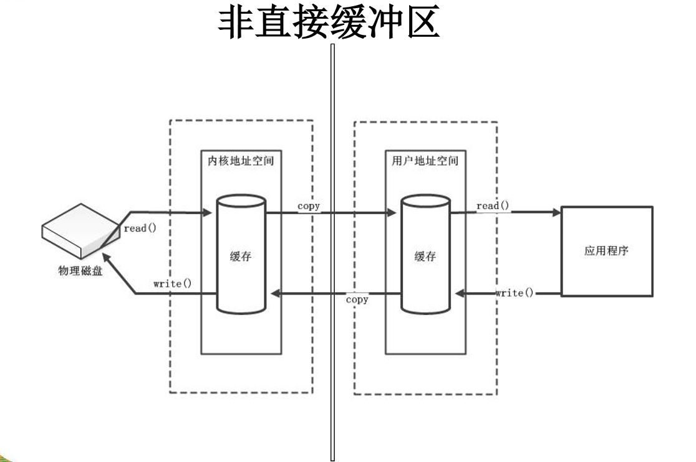
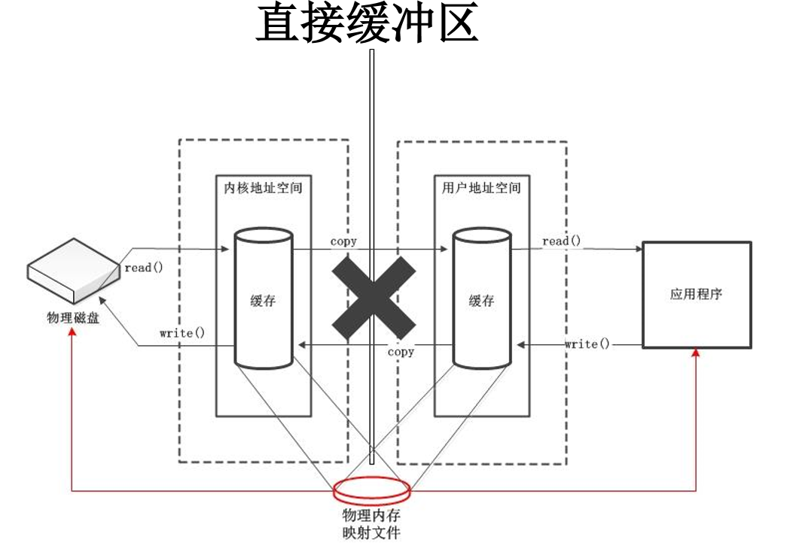

# 一、`NOI`

## 1.1.`nio`与`io`的区别

| `IO`                      | `NIO`                         |
| ------------------------- | ----------------------------- |
| 面向流`(Stream Oriented)` | 面向缓冲区`(Buffer Oriented)` |
| 阻塞IO`(Blocking IO)`     | 非阻塞IO`(Non Blocking IO)`   |
| 无                        | 选择器`(Selectors)`           |

### 1.1.1.`BIO`与`NIO`的区别

- `BIO`：是同步线程阻塞的，每一个连接都分配一个专用线程来处理请求，10个连接就会创建10个线程去处理
- `NIO`：是同步非阻塞的，核心技术是多路复用，可以使一个链接上的不同通道来处理不同的请求；即10个连接创建一个线程即可。


## 1.2.通道`(Channel)`

`Channel`表示IO源与目标之间连接，不能直接访问数据，只能与Buffer直接交互。

### 1.2.1.通道的主要实现类

- `FileChannel`:用于读取、写入、映射和操作文件的通道
- `SocketChannel`:通过`TCP`读取网络中的数据
- `ServerSocketChannel`:可以监听新进来的`TCP`连接，对每一个新进来的连接都会创建一个`SocketChannel`
- `DatagramChannel`:通过`UDP`读取网络中的数据通道

### 1.2.2.获取通道

- 对支持通道的对象调用`getChannel()`方法
  - 本地IO
    - `FileInputStream `
    - `FileOutputStream`
    - `RandomAccessFile`
  - 网络IO 
    - `DatagramSocket`
    - `Socket`
    - `ServerSocket`
- `Files.newByteChannel()`：JDK1.7后NIO2提供
- `Channel.open()`：JDK1.7后NIO2提供

```java
//使用通道完成文件复制，非直接缓冲区
FileInputStream fis = null;
FileOutputStream fos = null;
FileChannel fisChannel = null;
FileChannel fosChannel = null;
try {
    fis = new FileInputStream("1.jpg");
    fos = new FileOutputStream("2.jpg");
    //获取通道
    fisChannel = fis.getChannel();
    fosChannel = fos.getChannel();
    //分配缓冲区
    ByteBuffer buffer = ByteBuffer.allocate(1024);
    //读取数据
    while ((fisChannel.read(buffer)) != -1) {
        //转化为读模式
        buffer.flip();
        //写入数据
        fosChannel.write(buffer);
        //清空缓冲区
        buffer.clear();
    }
} catch (IOException e) {
    e.printStackTrace();
} finally {
    if (fisChannel != null) {
        try {
            fisChannel.close();
        } catch (IOException e) {
            e.printStackTrace();
        }
    }
    if (fosChannel != null) {
        try {
            fosChannel.close();
        } catch (IOException e) {
            e.printStackTrace();
        }
    }
    if (fis != null) {
        try {
            fis.close();
        } catch (IOException e) {
            e.printStackTrace();
        }
    }
    if (fos != null) {
        try {
            fos.close();
        } catch (IOException e) {
            e.printStackTrace();
        }
    }
}
```

```java
//使用直接缓冲区完成文件复制（内存映射文件）
FileChannel inChannel = null;
FileChannel outChannel = null;
try {
    //获取通道
    inChannel = FileChannel.open(Paths.get("1.jpg"), StandardOpenOption.READ);
    outChannel = FileChannel.open(Paths.get("2.jpg"), StandardOpenOption.READ, StandardOpenOption.WRITE, StandardOpenOption.CREATE);
    //内存映射文件
    MappedByteBuffer inBuffer = inChannel.map(FileChannel.MapMode.READ_ONLY, 0, inChannel.size());
    MappedByteBuffer outBuffer = outChannel.map(FileChannel.MapMode.READ_WRITE, 0, inChannel.size());
    //直接对缓存区进行读写
    byte[] dst = new byte[inBuffer.limit()];
    inBuffer.get(dst);
    outBuffer.put(dst);
} catch (IOException e) {
    e.printStackTrace();
} finally {
    if (inChannel != null) {
        try {
            inChannel.close();
        } catch (IOException e) {
            e.printStackTrace();
        }
    }
    if (outChannel != null) {
        try {
            outChannel.close();
        } catch (IOException e) {
            e.printStackTrace();
        }
    }
}
```

#### 1.2.2.1.`StandardOpenOption`

```java
public enum StandardOpenOption implements OpenOption {
    READ,   //以读取方式打开文件
    WRITE,  //以写入方式打开文件
    APPEND, //在文件的尾部追加
    TRUNCATE_EXISTING, //把文件设置为0字节
    CREATE, 	//如果文件不存在，创建
    CREATE_NEW, //如果文件不存在，创建；若存在，异常。
    DELETE_ON_CLOSE, //当流关闭的时候删除文件
    SPARSE,  //文件不够时创建新的文件
    SYNC,    //同步文件的内容和元数据信息随着底层存储设备
    DSYNC;	 //同步文件的内容随着底层存储设备 

    private StandardOpenOption() {
    }
}
```

#### 1.2.2.2.`MapMode`

- `READ_ONLY`:得到的镜像只能只读
- `READ_WRITE`:得到的镜像可读写
- `PRIVATE`:得到一个私有的镜像，一个(position, size)区域的副本，可读可写，只不过写不会影响到存储节点，就是一个普通的ByteBuffer

### 1.2.3.通道直接的数据传输

- `transferFrom()`:输出通道 --> 输入通道
- `transferTo()`:输入通道 --> 输出通道

```java
FileChannel inChannel = null;
FileChannel outChannel = null;
try {
    //获取通道
    inChannel = FileChannel.open(Paths.get("1.jpg"), StandardOpenOption.READ);
    outChannel = FileChannel.open(Paths.get("2.jpg"), StandardOpenOption.READ, StandardOpenOption.WRITE, StandardOpenOption.CREATE);
    //直接传输数据
    //inChannel.transferTo(0, inChannel.size(), outChannel);
    outChannel.transferFrom(inChannel, 0, inChannel.size());

} catch (IOException e) {
    e.printStackTrace();
} finally {
    if (inChannel != null) {
        try {
            inChannel.close();
        } catch (IOException e) {
            e.printStackTrace();
        }
    }
    if (outChannel != null) {
        try {
            outChannel.close();
        } catch (IOException e) {
            e.printStackTrace();
        }
    }
}
```

## 1.3.缓冲区`(Buffer)`

一个用于特定基本数据类型的容器，主要用于与NIO通道进行交互，数据是从通道读入缓冲区，从缓冲区写入通道中的；Buffer就像一个数组，可以保存多个相同类型的数据，根据数据类型不同(boolean除外)，有以下Buffer常用子类。
- `ByteBuffer`
- `CharBuffer`
- `ShortBuffer`
- `IntBuffer`
- `LongBuffer`
- `FloatBuffer`
- `DoubleBuffer`

### 1.3.1.缓冲区的基本属性

- `容量(capacity)` ：表示Buffer最大数据容量，缓冲区容量不能为负，并且创建后不能更改。
- `限制(limit)`：界限，表示可以操作数据的大小，即位于limit后的数据不可读写。缓冲区的限制不能为负，并且不能大于其容量。
- `位置(position)`：下一个要读取或写入的数据的索引。缓冲区的位置不能为负，并且不能大于其限制。
- `标记(mark)与重置(reset)`：标记是一个索引，通过Buffer中的mark()方法指定Buffer中一个特定的 position，之后可以通过调用reset()方法恢复到这个position。

- `0 <= mark <= position <= limit <= capacity`

### 1.3.2.`Buffer`常用方法

- `Buffer clear()`:清空缓存区，并返回缓存区的引用；此时缓存的数据依然存在，只是处于被遗忘状态，即只是重置了访问参数
- `Buffer flip()`:将缓存区的界限（limit）设置为当前位置，并将当前位置（position）设置为0
- `int capacity()`：返回Buffer的大小
- `boolean hasRemaining()`：判断缓存区中是否还存在元素
- `int limit()`:返回Buffer的界限（limit）位置
- `Buffer limit(int n)`:设置Buffer的界限为n，并返回新limit的Buffer对象
- `Buffer mark()`:对Buffer设置标记
- `int position()`:返回Buffer的当前位置
- `Buffer position(int n)`:设置Buffer的当前位置（position）为n，并返回新position的Buffer对象
- `int remaining()`:返回position与limit之间的元素个数
- `Buffer reset()`:将position转到之前mrak()设置的位置
- `Buffer rewind()`:将位置（position）设置为0，取消设置mark()标记
- `ByteBuffer get(byte[] dst)`:获取Buffer的元素
- `ByteBuffer put(byte[] src)`:向Buffer中添加元素

```java
//创建Buffer
ByteBuffer buffer = ByteBuffer.allocate(1024);//capacity-limit-position:1024-1024-0
//写数据
buffer.put("hello".getBytes());//1024-1024-5
//转化为读模式
buffer.flip();//1024-5-5
//读数据
byte[] bytes = new byte[buffer.limit()];
buffer.get(bytes, 0, 2);
String str = new String(bytes, 0, 2);
//标记
buffer.mark();
//读数据
buffer.get(bytes, 2, 2);
str = new String(bytes, 2, 2);
//回到mark()的位置
buffer.reset();
//判断是否还有元素
if (buffer.hasRemaining()) {
    //获取position与limit之间的元素
    int i = buffer.remaining();
}
//重置位置position
buffer.rewind();//1024-5-0
```

### 1.3.3.直接与非直接缓冲区

- 非直接缓冲区：通过`allocate()`分配缓冲区，将缓冲区建立在`JVM`的内存中。
- 直接缓冲区：通过`allocateDirect()`分配缓冲区，将缓冲区建立在物理内存中。
  - 可提高效率






## 1.4.分散`(Scatter)`与聚集`(Gather)`

- 分散读取`(Scattering Reads)`是指从Channel中读取的数据**分散** 到多个Buffer中 

> 注意：按照缓冲区的顺序，从Channel中读取的数据依次将Buffer填满 

- 聚集写入`(Gathering Writes)`是指将多个Buffer中的数据**聚集**到Channel

> 注意：按照缓冲区的顺序，写入position和limit之间的数据Channel 

```java
RandomAccessFile randomAccessFile = null;
FileChannel fileChannel = null;
try {
    randomAccessFile = new RandomAccessFile("pom.xml", "rw");
    //获取通道
    fileChannel = randomAccessFile.getChannel();
    //创建缓冲区
    ByteBuffer buf1 = ByteBuffer.allocate(100);
    ByteBuffer buf2 = ByteBuffer.allocate(1024);
    //分散读取
    ByteBuffer[] bufs = {buf1, buf2};
    fileChannel.read(bufs);

    for (int i = 0; i < bufs.length; i++) {
        bufs[i].flip();
    }
    System.out.println(new String(bufs[0].array(), 0, bufs[0].limit()));
    System.out.println("--------------------------------------------------------");
    System.out.println(new String(bufs[1].array(), 0, bufs[1].limit()));

    //聚集写入
    RandomAccessFile accessFile = new RandomAccessFile("test.xml", "rw");
    FileChannel channel = accessFile.getChannel();
    channel.write(buf2);

    channel.close();
    accessFile.close();
} catch (IOException e) {
    e.printStackTrace();
} finally {
    if (fileChannel != null) {
        try {
            fileChannel.close();
        } catch (IOException e) {
            e.printStackTrace();
        }
    }
    if (randomAccessFile != null) {
        try {
            randomAccessFile.close();
        } catch (IOException e) {
            e.printStackTrace();
        }
    }
}
```


## 1.5.字符集

编码：字符串 --> 字符数组

解码：字符数组 --> 字符串

```java
//所有支持的字符集
SortedMap<String, Charset> map = Charset.availableCharsets();
Set<Map.Entry<String, Charset>> entries = map.entrySet();
entries.stream().map(Map.Entry::getKey).forEach(System.out::println);
```

```java
Charset charset = Charset.forName("GBK");
//编码器
CharsetEncoder encoder = charset.newEncoder();
//解码器
CharsetDecoder decoder = charset.newDecoder();

CharBuffer charBuffer = CharBuffer.allocate(1024);
charBuffer.put("辉夜大小姐");
charBuffer.flip();

//编码
ByteBuffer byteBuffer = encoder.encode(charBuffer);
System.out.println(byteBuffer.remaining());

//解码
charBuffer.flip();
CharBuffer buffer = decoder.decode(byteBuffer);
System.out.println(buffer.toString());
```

## 1.6.选择器`(selelctor)`

选择器`(selector)`是`SelectableChannel`的多路复用器。用于监控`SelectableChannel`的IO状况。


## 1.7.网络通信

### 1.7.1.网络通信的三大核心

- 通道`(Channel)`:负责连接
  -  `SelectableChannel`:
    - `SocketChannel`:
    - `ServerSocketChannel`:
    - `DatagramChannel`:
    - `Pipe.SinkChannel`:
    - `Pipe.SourceChannel`:
- 缓冲区`(BUffer)`:负责数据的存取
- 选择器`(selelctor)`：是`SelectableChannel`的多路复用器。用于监控`SelectableChannel`的IO状况。

```java
//客户端
@Test
public void client(){
    SocketChannel socketChannel = null;
    FileChannel inChannel = null;
    try {
        //获取通道
        socketChannel = SocketChannel.open(new InetSocketAddress("127.0.0.1", 8499));
        inChannel = FileChannel.open(Paths.get("1.jpg"), StandardOpenOption.READ);
        //缓冲区
        ByteBuffer buffer = ByteBuffer.allocate(1024);
        //发送数据
        while (inChannel.read(buffer) != -1) {
            buffer.flip();
            socketChannel.write(buffer);
            buffer.clear();
        }
        //发送完成
        socketChannel.shutdownOutput();
        //接收反馈
        int len;
        while ((len = socketChannel.read(buffer)) != -1) {
            buffer.flip();
            //反馈信息
            System.out.println(new String(buffer.array(), 0, len));
            buffer.clear();
        }
    } catch (IOException e) {
        e.printStackTrace();
    } finally {
        if (inChannel != null) {
            try {
                inChannel.close();
            } catch (IOException e) {
                e.printStackTrace();
            }
        }
        if (socketChannel != null) {
            try {
                socketChannel.close();
            } catch (IOException e) {
                e.printStackTrace();
            }
        }
    }
}
```

```java
//服务器
@Test
public void service() {
    ServerSocketChannel serverSocketChannel = null;
    FileChannel outChannel = null;
    SocketChannel socketChannel = null;
    try {
        //打开通道
        serverSocketChannel = ServerSocketChannel.open();
        outChannel = FileChannel.open(Paths.get("2.jpg"), StandardOpenOption.WRITE, StandardOpenOption.CREATE);
        //监听端口
        serverSocketChannel.bind(new InetSocketAddress(8499));
        //接收数据
        socketChannel = serverSocketChannel.accept();
        //缓冲区
        ByteBuffer buffer = ByteBuffer.allocate(1024);
        //数据存入服务器
        while (socketChannel.read(buffer) != -1) {
            buffer.flip();
            outChannel.write(buffer);
            buffer.clear();
        }
        //存入完成
        socketChannel.shutdownInput();
        //发送反馈信息
        buffer.put("数据传输完成！".getBytes());
        buffer.flip();
        socketChannel.write(buffer);
        buffer.clear();
    } catch (IOException e) {
        e.printStackTrace();
    } finally {
        if (outChannel != null) {
            try {
                outChannel.close();
            } catch (IOException e) {
                e.printStackTrace();
            }
        }
        if (socketChannel != null) {
            try {
                socketChannel.close();
            } catch (IOException e) {
                e.printStackTrace();
            }
        }
        if (serverSocketChannel != null) {
            try {
                serverSocketChannel.close();
            } catch (IOException e) {
                e.printStackTrace();
            }
        }
    }
}
```

