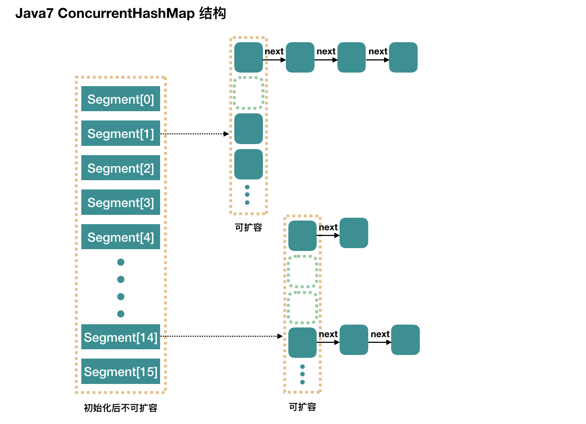

# 一、`volatile`

`volatile`修饰的共享变量，当多个线程操作时，可保证数据的可见性；即可相当于之间在主内存中操作数据。

- `volatile`是比`synchronized`更轻量级的同步策略 
- `volatile`不具有互斥性
- `volatile`不能保证变量的原子性

## 1.1.内存可见性

内存可见性：多个线程操作共享数据时，彼此之间的数据不可见

```java
public class MemoryRunnable implements Runnable {
	//共享变量
    private boolean flag = false;

    public boolean isFlag() {
        return flag;
    }

    public void setFlag(boolean flag) {
        this.flag = flag;
    }

    @Override
    public void run() {
        try {
            Thread.sleep(2000);
        } catch (InterruptedException e) {
            e.printStackTrace();
        }
        System.out.println("flag=true");
        flag = true;
    }
}
```

```java
@Test
public void test01(){
    MemoryRunnable runnable = new MemoryRunnable();
    Thread thread = new Thread(runnable);
    thread.start();
    while(true){
        if(runnable.isFlag()){
            System.out.println("退出循环");
            break;
        }
    }
}
```

> 此时只会输出`flag=true`，且不能退出循环

解决方法：使用`volitille`修饰共享数据

```java
private volitile boolean flag = false;
```


# 二、原子性

- 内部使用`volitile`修饰，保证内存可见性
- CAS（Compare-And-Swap）算法保证数据的原子性
  - CAS算法是硬件对并发操作共享数据的支持，是一种无锁算法
  - CAS包含三个操作数
    - 内存值`V`
    - 预估值（旧值）`A`
    - 更新值`B`
    - 当且仅当`V==A`时，才赋值`V=B`，否则不操作

```java
public class AtomicTest {

    public static void main(String[] args) {
        AtomicRunnable runnable = new AtomicRunnable();
        for (int i = 0; i < 10; i++) {
            new Thread(runnable).start();
        }
    }
}

class AtomicRunnable implements Runnable {
    //共享变量
    public int serialNumber = 0;

    public int getSerialNumber() {
        return serialNumber++;
    }

    @Override
    public void run() {
        try {
            Thread.sleep(200);
        } catch (InterruptedException e) {
            e.printStackTrace();
        }
        System.out.println(getSerialNumber());
    }
}
```

此时对于共享变量`serialNumber`，进行`serialNumber++`操作时，由于`serialNumber++`不是原子性操作，故可能会出现重复的数据。

解决方法：使用`AtomicInteger`类，保证`serialNumber`的自增操作是一个原子操作

```java
public class AtomicTest {

    public static void main(String[] args) {
        AtomicRunnable runnable = new AtomicRunnable();
        for (int i = 0; i < 10; i++) {
            new Thread(runnable).start();
        }
    }

}

class AtomicRunnable implements Runnable{

    public AtomicInteger serialNumber = new AtomicInteger(0);

    public int getSerialNumber() {
        return serialNumber.getAndIncrement();
    }

    @Override
    public void run() {
        try {
            Thread.sleep(200);
        } catch (InterruptedException e) {
            e.printStackTrace();
        }
        System.out.println(getSerialNumber());
    }
}
```


## 2.1.模拟CAS算法

```java
public class CompareAndSwap {
    
    //使用main()方法测试cas算法，使用@Test测试有些问题
    public static void main(String[] args) {
        final CompareAndSwap cas = new CompareAndSwap();
        for (int i = 0; i < 10; i++) {
            new Thread(new Runnable() {
                @Override
                public void run() {
                    int expectedValue = cas.get();
                    boolean b = cas.compareAndSet(expectedValue, (int) (Math.random() * 101));
                    System.out.println(b);
                }
            }).start();
        }
    }

    //内存值
    private int value;

    //获取内存值
    public synchronized int getValue() {
        return value;
    }

    /**
     *  比较值
     * @param expectedValue 预估值
     * @param newValue 新值
     */
    public synchronized int compareAndSwap(int expectedValue,int newValue){
        int oldValue = value;
        if(oldValue == expectedValue){
            this.value = newValue;
        }
        return oldValue;
    }

    /**
     * 设置新值
     * @param expectedValue 预故值
     * @param newValue 新值
     * @return
     */
    public synchronized  boolean compareAndSet(int expectedValue,int newValue){
        return expectedValue == compareAndSwap(expectedValue, newValue);
    }
}
```


## 2.2.CAS算法存在的问题

- `ABA`问题
- 循环时间长，开销大
- 只能保证一个共享变量的原子性操作


# 三、`ConcurrentHashMap`

`ConcurrentHashMap`采用锁分段机制

`concurrentLevel=16`每`16`个数据分为一个段，每个段都是独立的锁



## 3.1.`CopyOnWriteArrayList`

- 并发迭代操作多时可使用该类
- 添加操作多时，效率低，不建议使用，原因：每次写入数据都复制一份，效率低

> List在迭代遍历时，进行插入操作

```java
public static void main(String[] args) {
    final ArrayList<Object> list = new ArrayList<>();
    list.add(1);
    list.add(2);
    list.add(3);
    System.out.println(list);

    for (int i = 0; i < 10; i++) {
        new Thread(new Runnable() {
            @Override
            public void run() {
                synchronized (this) {
                    Iterator<Object> iterator = list.iterator();
                    while (iterator.hasNext()) {
                        Object next = iterator.next();
                        list.add(4);
                    }
                }
            }
        }).start();
    }
}
```

此时会报并行修改异常`java.util.ConcurrentModificationException`，解决方法：使用`CopyOnWriteArrayList`

```java
public static void main(String[] args) {
    //该类每次添加会复制一份
    CopyOnWriteArrayList list = new CopyOnWriteArrayList();
    list.add(1);
    list.add(2);
    list.add(3);
    System.out.println(list);

    for (int i = 0; i < 10; i++) {
        new Thread(new Runnable() {
            @Override
            public void run() {
                synchronized (this) {
                    Iterator<Object> iterator = list.iterator();
                    while (iterator.hasNext()) {
                        Object next = iterator.next();
                        list.add(4);
                    }
                }
            }
        }).start();
    }
}
```

## 3.2.`CopyOnWriteArraySet`

每次写入时都复制一份再写入

- 添加多时，效率低
- 并发迭代多时，效率较高


## 3.3.`JDK7`与`JDK8`中的区别

在`JDK7`中使用锁分段机制

在`JDK8`中使用`CAS`算法


[^1]: http://www.importnew.com/28263.html


# 四、锁

## 4.1.闭锁`CountDownLatch`

`CountDownLatch`是一个同步辅助类，在完成一组正在其他线程中执行的操作之前，它允许一个或多个线程一直等待；即某些运算完成，只有当其它线程所有的运算都完成时，当前线程运算才能执行。

> 计算多个线程的执行时间

```java
public class DownLatchRunnable implements Runnable {
    @Override
    public void run() {
        for (int i = 0; i < 50000; i++) {
            if (i % 2 == 0) {
                System.out.println(i);
            }
        }
    }
}
```

```java
public void test03() {
    CountDownLatch latch = new CountDownLatch(5);
    long start = System.currentTimeMillis();
    for (int i = 0; i < 5; i++) {
        new Thread(new DownLatchRunnable()).start();
    }
    long end = System.currentTimeMillis();
    System.out.println((end - start) + "ms");//这是计算的主线程的时间
}
```

此时不能计算出所有线程执行的时间，因为可能有的线程还没执行完成，就计算了时间（不准确）

```java
public class DownLatchRunnable implements Runnable {

    private CountDownLatch latch;

    public DownLatchRunnable(CountDownLatch latch) {
        this.latch = latch;
    }

    @Override
    public void run() {
        synchronized (this){
             try{
                for (int i = 0; i < 50000; i++) {
                    if (i % 2 == 0) {
                        System.out.println(i);
                    }
                }
            }finally {
                //每执行一个线程，等待数减1
                latch.countDown();
            }
        } 
    }
}
```

```java
public void test03() {
    //创建闭锁的数目
    CountDownLatch latch = new CountDownLatch(5);
    long start = System.currentTimeMillis();
    for (int i = 0; i < 5; i++) {
        new Thread(new DownLatchRunnable(latch)).start();
    }
    //等待其他所有线程执行完成，才继续执行
    try {
        latch.await();
    } catch (InterruptedException e) {
        e.printStackTrace();
    }
    long end = System.currentTimeMillis();
    System.out.println((end - start) + "ms");
}
```

```java
//计算时间差
Instant start = Instant.now();
......
Instant end = Instant.now();
long millis = Duration.between(start, end).toMillis();
```

此时就会等待所有的线程执行完成后，才计算执行时间

## 4.2.`FutureTask`实现闭锁


## 4.3.同步锁`Lock`

- `lock()`加锁
- `unlock()`释放锁，一般放在`finally`中执行

```java
public class Ticket implements Runnable {
    private int tick = 100;
    private Lock lock = new ReentrantLock();

    @Override
    public void run() {
        while (true) {
            try {
                lock.lock();
                if (tick > 0) {
                    try {
                        Thread.sleep(20);
                    } catch (InterruptedException e) {
                        e.printStackTrace();
                    }
                    System.out.println(Thread.currentThread().getName() + "号窗口完成售票，余票为：" + (--tick));
                }
            } finally {
                //释放锁
                lock.unlock();
            }
        }
    }
}
```

```java
//注意：需在主线程中测试，在test()中不行
public static void main(String[] args) {
    Ticket ticket = new Ticket();
    new Thread(ticket,"1").start();
    new Thread(ticket,"2").start();
    new Thread(ticket,"3").start();
}
```

## 4.4.读写锁

`ReadWriteLock`维护一队相关的锁，一个用于只读操作，一个用于写入操作。只要没有`write`，读取锁可以有多个`reader`线程持有；写入锁是独占锁。

- `写写、读写`需要操作互斥
- `读读`不需要互斥

`ReadWriteLock`针对读取操作占多数的情况，能比独占锁提供更高的并发性。

```java
public class ReadWriteLockDemo {
    private int number = 0;
    private ReadWriteLock lock = new ReentrantReadWriteLock();

    public void get() {
        lock.readLock().lock();
        try {
            System.out.println(Thread.currentThread().getName() + ":" + number);
        } finally {
            lock.readLock().unlock();
        }
    }

    public void set(int number) {
        lock.writeLock().lock();
        try {
            System.out.println(Thread.currentThread().getName());
            this.number = number;
        } finally {
            lock.writeLock().unlock();
        }
    }

    public static void main(String[] args) {
        ReadWriteLockDemo rwd = new ReadWriteLockDemo();
        new Thread(new Runnable() {
            @Override
            public void run() {
                rwd.set(new Random().nextInt(10) + 1);
            }
        }, "Write").start();
        for (int i = 0; i < 10; i++) {
            new Thread(new Runnable() {
                @Override
                public void run() {
                    rwd.get();
                }
            }, "Read" + i).start();
        }
    }
}
```

```java
Write
Read0:9
Read1:9
Read3:9
Read6:9
Read5:9
Read8:9
Read2:9
Read4:9
Read9:9
Read7:9
```

## 4.5.线程八锁

线程八锁的结论：

- 非静态方法的锁默认是`this`，静态方法的锁默认是**对应`Class`实例**
- 某一时刻内，只有一个线程能持有锁，无论几个方法

线程八锁是针对线程中的同步方法、静态同步方法、非同步方法的加锁对象，引发得到八种情况；

- 两个方法都是普通的同步方法，打印`one two`；

```java
public class Thread8MonitorDemo {
    public static void main(String[] args) {
        Number number = new Number();
        new Thread(new Runnable() {
            @Override
            public void run() {
                //此时的锁是this
                number.getOne();
            }
        }).start();

        new Thread(new Runnable() {
            @Override
            public void run() {
                number.getTwo();
            }
        }).start();
    }

}
```

```java
class Number {

    public synchronized void getOne() {
        System.out.println("one");
    }

    public synchronized void getTwo() {
        System.out.println("two");
    }
}
```

- 给`getOne()`方法设置`Thread.sleep()`，打印`one two`

```java
class Number {
    public synchronized void getOne() {
        try {
            Thread.sleep(2000);
        } catch (InterruptedException e) {
            e.printStackTrace();
        }
        System.out.println("one");
    }

    public synchronized void getTwo() {
        System.out.println("two");
    }
}
```

- 新增普通方法`getThree()`，打印`three one two`

```java
public class Thread8MonitorDemo {

    public static void main(String[] args) {
        Number number = new Number();
        new Thread(new Runnable() {
            @Override
            public void run() {
                number.getOne();
            }
        }).start();

        new Thread(new Runnable() {
            @Override
            public void run() {
                number.getTwo();
            }
        }).start();

        new Thread(new Runnable() {
            @Override
            public void run() {
                number.getThree();
            }
        }).start();
    }

}
```

```java
class Number {

    public synchronized void getOne() {
        try {
            Thread.sleep(2000);
        } catch (InterruptedException e) {
            e.printStackTrace();
        }
        System.out.println("one");
    }

    public synchronized void getTwo() {
        System.out.println("two");
    }

    public void getThree() {
        System.out.println("three");
    }

}
```

- 两个普通同步方法，但是两个`Number`对象，打印`two one`

```java
public class Thread8MonitorDemo {
    public static void main(String[] args) {
        Number number = new Number();
        Number number2 = new Number();
        new Thread(new Runnable() {
            @Override
            public void run() {
                number.getOne(); //此时锁对象是number
            }
        }).start();

        new Thread(new Runnable() {
            @Override
            public void run() {
                number2.getTwo();//此时锁对象是number2
            }
        }).start();
    }
}
```

```java
class Number {
    public synchronized void getOne() {
        try {
            Thread.sleep(2000);
        } catch (InterruptedException e) {
            e.printStackTrace();
        }
        System.out.println("one");
    }

    public synchronized void getTwo() {
        System.out.println("two");
    }
}
```

- 修改`getOne()`为静态方法，打印`two one`

```java
public class Thread8MonitorDemo {
    public static void main(String[] args) {
        Number number = new Number();
        new Thread(new Runnable() {
            @Override
            public void run() {
                number.getOne();
            }
        }).start();

        new Thread(new Runnable() {
            @Override
            public void run() {
                number.getTwo();
            }
        }).start();
    }
}
```

```java
class Number {
    public static synchronized void getOne() {
        try {
            Thread.sleep(2000);
        } catch (InterruptedException e) {
            e.printStackTrace();
        }
        System.out.println("one");
    }

    public synchronized void getTwo() {
        System.out.println("two");
    }
}
```

- 两个方法都为静态同步方法，一个`Number`对象，打印`one two`

```java
class Number {
    public static synchronized void getOne() {
        try {
            Thread.sleep(2000);
        } catch (InterruptedException e) {
            e.printStackTrace();
        }
        System.out.println("one");
    }

    public static synchronized void getTwo() {
        System.out.println("two");
    }
}
```

- 一个静态同步方法，一个非静态同步方法，两个`Number`对象，打印`two one`

```java
public class Thread8MonitorDemo {

    public static void main(String[] args) {
        Number number = new Number();
        Number number2 = new Number();
        new Thread(new Runnable() {
            @Override
            public void run() {
                number.getOne();
            }
        }).start();

        new Thread(new Runnable() {
            @Override
            public void run() {
                number2.getTwo();
            }
        }).start();
    }
}
```

```java
class Number {
    public static synchronized void getOne() {
        try {
            Thread.sleep(2000);
        } catch (InterruptedException e) {
            e.printStackTrace();
        }
        System.out.println("one");
    }

    public synchronized void getTwo() {
        System.out.println("two");
    }
}
```

- 两个静态同步方法，两个`Number`对象，打印`one two`

```java
public class Thread8MonitorDemo {

    public static void main(String[] args) {
        Number number = new Number();
        Number number2 = new Number();
        new Thread(new Runnable() {
            @Override
            public void run() {
                number.getOne();
            }
        }).start();

        new Thread(new Runnable() {
            @Override
            public void run() {
                number2.getTwo();
            }
        }).start();
    }
}
```

```java
class Number {
    public static synchronized void getOne() {
        try {
            Thread.sleep(2000);
        } catch (InterruptedException e) {
            e.printStackTrace();
        }
        System.out.println("one");
    }

    public static synchronized void getTwo() {
        System.out.println("two");
    }
}
```


# 五、线程池

## 5.1.为什么使用多线程？

因为使用多线程，可以将一个大任务分解成多个小任务执行，互不影响的小任务同时执行，可以充分使用`CPU`资源，提高效率。

## 5.2.为什么使用线程池？

因为当我们需要并发执行的线程数很多，且每个线程执行时间很短时，这样频繁的创建或销毁线程（创建或销毁线程需要时间和资源），会大大降低工作效率。

而线程池能解决频繁创建和销毁线程的问题，线程池可以在一个线程执行任务完成后，继续执行下一个任务，不被销毁，从而提高线程的利用率。

## 5.3.线程池的常用参数

```java
//创建线程池
public ThreadPoolExecutor(int corePoolSize,
                          int maximumPoolSize,
                          long keepAliveTime,
                          TimeUnit unit,
                          BlockingQueue<Runnable> workQueue,
                          ThreadFactory threadFactory,
                          RejectedExecutionHandler handler) {
    if (corePoolSize < 0 ||
        maximumPoolSize <= 0 ||
        maximumPoolSize < corePoolSize ||
        keepAliveTime < 0)
        throw new IllegalArgumentException();
    if (workQueue == null || threadFactory == null || handler == null)
        throw new NullPointerException();
    this.acc = System.getSecurityManager() == null ?
        null :
    AccessController.getContext();
    this.corePoolSize = corePoolSize;
    this.maximumPoolSize = maximumPoolSize;
    this.workQueue = workQueue;
    this.keepAliveTime = unit.toNanos(keepAliveTime);
    this.threadFactory = threadFactory;
    this.handler = handler;
}
```

- `corePoolSize`:核心线程数；
  - 线程池在创建后，不会取立即创建线程，而是在等待执行线程到来；
  - 当**执行线程数**`>`**核心线程数**，线程会就会加入到缓存队列；
  - 核心线程会一直存在，即使没有任务需要执行；
  - 当线程数`<`核心线程数，即使有线程空闲，线程池也会优先创建新线程处理任务；
  - `allowCoreThreadTimeout=true`时，核心线程超时后会关闭。
- `maximumPoolSize`:线程池创建的最大线程数
  - 当前线程数`>`核心线程数，且任务队列已满时，线程池会创建新任务来处理任务；
  - 当前线程数`=`最大线程数，且任务队列已满时，线程池会拒绝处理线程而抛出异常。
- `keepAliveTime`:空闲线程多久时间被销毁；
  - 当线程空闲时间到达`keepAliveTime`时，线程会退出，直到线程的数量`=`核心线程数；
  - 若`allowCoreThreadTimeout=true`时，则会直到线程数为`0`。
- `allowCoreThreadTimeout`:运行核心线程数超时；
- `unit`:`keepAliveTime`的时间单位，`TimeUnit`枚举值
  - `TimeUnit.DAYS`:天
  - `TimeUnit.HOURS`:小时
  - `TimeUnit.MINUTES`:分钟
  - `TimeUnit.SECONDS`:秒
  - `TimeUnit.MILLISECONDS`:毫秒
  - `TimeUnit.MICROSECONDS`:微妙
  - `TimeUnit.NANOSECONDS`:纳秒
- `workQueue`:阻塞队列，用来储存等待的任务；设置线程池的排队策略
  - `ArrayBlockingQueue`:
  - `LinkedBlockingQueue`:
  - `SynchronousQueue`:


- `threadFactory`:线程工厂，用来创建线程；默认使用`Executors.DefaultThreadFactory()`线程工厂。
- `handler`:线程拒绝策略，在线程池无法执行或保存新提交的任务时进行处理的对象；
  - 两种情况会拒绝处理任务
    - 当线程池的数量`>maximumPoolSize`，且缓存队列已满时；
    - 线程池调用`shutdown()`方法后，会等待线程池里的任务执行完毕，才执行`shutdown()`；若在调用`shutdown()`与线程池真正执行`shutdown()`之间提交任务的，会拒绝处理
  - 新任务的拒绝处理策略：
    - `ThreadPoolExecutor.AbortPolicy`:丢弃任务并抛出`RejectedExecutionException`异常，默认值；
    - `ThreadPoolExecutor.DiscardPolicy`：丢弃任务但不抛出异常；
    - `ThreadPoolExecutor.DiscardOldestPolicy`:丢弃队列最前面的任务，然后重新尝试执行任务（重复该该过程）；
    - `ThreadPoolExecutor.CallerRunsPolicy`:由调用线程处理该任务。


```java
//默认策略。使用该策略时， 
class AbortPolicy implements RejectedExecutionHandler{
 
　　public void rejectedExecution(Runnable r, ThreadPoolExecutor executor) {
　　　　throw new RejectedExecutionException("Task " + r.toString() +
　　　　" rejected from " +
　　　　executor.toString());
　　}
}
//如果线程池队列满了，会直接丢掉这个任务并且不会有任何异常
class DiscardPolicy implements RejectedExecutionHandler{
 
　　public void rejectedExecution(Runnable r, ThreadPoolExecutor executor) {
 
　　}
}
//丢弃最老的,会将最早进入队列的任务删掉腾出空间，再尝试加入队列
class DiscardOldestPolicy implements RejectedExecutionHandler{
 
　　public void rejectedExecution(Runnable r, ThreadPoolExecutor executor) {
　　　　if (!executor.isShutdown()) {
　　　　　　//移除队头元素
　　　　　　executor.getQueue().poll();
　　　　//再尝试入队
　　　　　　executor.execute(r);
　　　　}
　　}
}
//主线程会自己去执行该任务，不会等待线程池中的线程去执行
class CallerRunsPolicy implements RejectedExecutionHandler{
 
　　public void rejectedExecution(Runnable r, ThreadPoolExecutor executor) {
　　　　if (!executor.isShutdown()) {
　　　　　　//直接执行run方法
　　　　　　r.run();
　　　　}
　　}
}
```

### 5.3.1.`ThreadPoolExecutor`执行顺序

1. 当线程数`<`核心线程数时，执行任务会创建新线程；
2. 当线程数`>=`核心线程数，且任务队列未满时，就会将任务通过阻塞队列`workerQueue`的`offer()`方法来将任务添加到队列中保存，并等待线程空闲后进行执行；
3. 当线程数`>=`核心线程数，且任务队列已满
   - 当线程数`<`最大线程数，创建新线程
   - 当线程数`=`最大线程数，抛出异常，拒绝任务


### 5.3.2.默认参数

```java
corePoolSize=1
queueCapacity=Integer.MAX_VALUE
maxPoolSize=Integer.MAX_VALUE
keepAliveTime=60s
allowCoreThreadTimeout=false
rejectedExecutionHandler=AbortPolicy()
```

### 5.3.3.如何设置参数

一般根据下列值决定设置的值：

- `tasks`:每秒的任务数
- `taskcost`:每个任务花费的时间
- `responsetime`:系统允许容忍的最大时间

计算：

- `corePoolSize `每秒需要的线程

```java
threadcount = tasks * taskcout = 
```


[^1]: https://www.cnblogs.com/owenma/p/8557074.html


## 5.4.`Spring`的线程池

`Spring`的线程池由`ThreadPoolTaskExecutor`实现，该类最终也是调用`Java`中的`ThreadPoolExecutor`的方法；

常用的配置参数：

- `corePoolSize`:核心线程数
- `keepAliveSeconds`:空闲线程处理时间
- `maxPoolSize`：最大线程数
- `queueCapacity`:任务队列（阻塞队列）容量
  - 当核心线程数达到最大后，新任务就会放在任务队列中
- `handler`:线程拒绝处理器

```java
private void test2(){
    ThreadPoolTaskExecutor executor = new ThreadPoolTaskExecutor();
    executor.setCorePoolSize(10);
    executor.setMaxPoolSize(15);
    executor.setKeepAliveSeconds(1);
    executor.setQueueCapacity(5);
    executor.setRejectedExecutionHandler(new ThreadPoolExecutor.CallerRunsPolicy());
    executor.initialize();
    executor.execute(new Runnable(){
        @Override
        public void run() {
            //执行的代码
        }
    });
}
```


## 5.5.线程池的体系结构

`java.util.concurrent.Executor`:负责线程的使用与调度的根接口

- `ExecutorService`:线程池的主要接口
  - `ThreadPoolExecutor`:线程池的实现类
  - `ScheduledExecutorService`:线程池子接口，负责线程的调度
    - `ScheduledThreadPoolExecutor`:继承于`ThreadPoolExecutor`，实现了`ScheduledExecutorService`接口

### 5.5.1.工具类`Executors`

> `ExecutorService newFixedThreadPool()`：创建固定大小的线程池

```java
public static ExecutorService newFixedThreadPool(int nThreads) {
    return new ThreadPoolExecutor(nThreads, nThreads,//线程池的数量会保存在nThreads
                                  0L, TimeUnit.MILLISECONDS,//只有核心线程，不考虑超时释放
                                  new LinkedBlockingQueue<Runnable>());//无界队列，在所有线程都在处理任务时，可以无限添加任务到阻塞队列中等待执行
}
```

定长线程池中的线程数会逐步增加到`nThreads`个，并且之后的空闲线程不会被释放，线程数会一直保持在`nThreads`个。若添加任务时所有的线程都在忙碌，就将任务添加到阻塞队列中等待执行，阻塞队列中的任务数没有上限。

- 优点：线程数固定，对系统资源的消耗可控。

- 缺点：在任务暴增的情况下线程池不会弹性的增长，会导致线程完成时间延迟；使用了无界队列，在线程数设置过小的情况下可能会导致过多的任务积压，引起任务完成时间过晚和资源被过度消耗的问题。

- 使用场景：任务的峰值不会太高，但任务对响应时间要求不高的场景。

> `ExecutorService newCachedThreadPool()`:缓存线程池，线程池的数量不固定，可以根据需求自动更改数量

```java
public static ExecutorService newCachedThreadPool() {
    return new ThreadPoolExecutor(0, Integer.MAX_VALUE,//线程池中可以有无限多个线程
                                  60L, TimeUnit.SECONDS,//线程空闲60秒后会被回收
                                  new SynchronousQueue<Runnable>());//阻塞队列，每一个新添加的任务都要马上有一个工作线程进行处理
}
```

可缓存线程池会优先使用空闲线程，若没有空闲线程就创建一个线程，线程池没有上限，所以每一个任务都会马上被分配到一个工作线程进行执行，不需要在阻塞队列中等待；

- 优点：任务添加后可以马上执行，不需要在阻塞队列中等待；线程在闲置时不会保留，可节约系统资源。
- 缺点：对线程数没有限制，可能会过量的消耗系统资源。
- 适用场景：适用于大量短耗时的任务，和对响应时间要求较高的场景。

> `ExecutorService newSingleThreadExecutor()`:创建单个线程，线程池中只有一个线程

```java
public static ExecutorService newSingleThreadExecutor() {
    return new FinalizableDelegatedExecutorService
        (new ThreadPoolExecutor(1, 1,//线程池中只有一个线程
                                0L, TimeUnit.MILLISECONDS,
                                new LinkedBlockingQueue<Runnable>()));
}
```

单线程池只有一个工作线程，可保证添加的任务按指定顺序执行(先进先出、后进先出、优先级)，其优点：

- 通过共享线程池可很方便地提交任务进行异步执行，而不用自己管理线程的生命周期；
- 以使用任务队列并指定任务的执行顺序，很容易做到任务管理的功能

> `ScheduledExecutorService newScheduledThreadPool()`:创建固定大小的线程池，可以延迟或定时执行任务

```java
public static ScheduledExecutorService newScheduledThreadPool(int corePoolSize) {
    return new ScheduledThreadPoolExecutor(corePoolSize);
}

public ScheduledThreadPoolExecutor(int corePoolSize) {
    super(corePoolSize, Integer.MAX_VALUE, //在任务量较大时，可以创建大量新线程执行任务
          0, NANOSECONDS,//空闲线程会被立即销毁
          new DelayedWorkQueue());//延时工作队列，队列中的任务都有对应的过期时间，只有到达过期时间的任务才会弹出
}
```


## 5.6.常用的方法

### 5.6.1.关闭线程池

- `shutdown()`:有序关闭线程池，调用后线程池会让已提交的任务完成执行，但是不会再接收新任务。
- `shutdoenNow()`:直接关闭线程池，线程池中正在运行的任务会被中断，正在等待执行的任务不会执行，但是这些还在阻塞队列中的任务会被作为返回值放回。

### 5.6.2.监控线程池的运行状态

- `getTaskCount()`:线程池中已完成、执行中、等待执行的任务总数的估计值；因为统计过程中任务会发生动态变化，所以结果并不是一个准确值。
- `getCompletedTaskCount()`:线程池中已完成的任务总数，也是一个估计值。
- `getLargestPoolSize()`:线程池创建过的最大线程数，通过该数据可知道线程池是否到达过`maximumPoolSize`。
- `getPoolSize()`:线程池当前的线程数。
- `getActiveCount()`:当前线程池正在执行任务的线程数量估计值。


## 5.7.源码分析

### 5.7.1.`execute()`

```java
public void execute(Runnable command) {
    // 检查提交的任务是否为空
    if (command == null)
        throw new NullPointerException();
    
    // 获取控制变量值
    int c = ctl.get();
    // 检查当前线程数是否达到了核心线程数
    if (workerCountOf(c) < corePoolSize) {
        // 未达到核心线程数，则创建新线程
        // 并将传入的任务作为该线程的第一个任务
        if (addWorker(command, true))
            // 添加线程成功则直接返回，否则继续执行
            return;

        // 因为前面调用了耗时操作addWorker方法
        // 所以线程池状态有可能发生了改变，重新获取状态值
        c = ctl.get();
    }

    // 判断线程池当前状态是否是运行中
    // 如果是则调用workQueue.offer方法将任务放入阻塞队列
    if (isRunning(c) && workQueue.offer(command)) {
        // 因为执行了耗时操作“放入阻塞队列”，所以重新获取状态值
        int recheck = ctl.get();
        // 如果当前状态不是运行中，则将刚才放入阻塞队列的任务拿出，如果拿出成功，则直接拒绝这个任务
        if (! isRunning(recheck) && remove(command))
            reject(command);
        else if (workerCountOf(recheck) == 0)
            // 如果线程池中没有线程了，那就创建一个
            addWorker(null, false);
    }
    // 如果放入阻塞队列失败（如队列已满），则添加一个线程
    else if (!addWorker(command, false))
        // 如果添加线程失败（如已经达到了最大线程数），则拒绝任务
        reject(command);
}
```


# 六、线程

## 6.1.`Callable`与`Runnable`的区别

- `Callable`有返回值，且可以抛出异常

```java
MyCallable callable = new MyCallable();
//FutureTask用于接收运算结果，是Future接口的实现
FutureTask futureTask = new FutureTask(callable);
Thread thread2 = new Thread(futureTask);
thread2.start();
//接收线程运算后的结果，当线程执行完成，才会等到结果;FutureTask也可用于闭锁
futureTask.get();
```

- `Runnable`没有返回值，且不能抛出异常

## 6.2.解决多线程安全方式？

- 同步代码块`synchronized ()`
- 同步方法
- 同步锁`Lock`

> 显示锁`(Lock)`，隐式锁`(synchronized )`

## 6.3.生成者与消费者案例

```java
//店员
public class Clerk {
    private int product = 0;

    //进货
    public void get() {
        if (product >= 10) {
            System.out.println("商品已满");
        } else {
            System.out.println(Thread.currentThread().getName() + "：" + (++product));
        }
    }

    //卖货
    public void sale() {
        if (product <= 0) {
            System.out.println("缺货");
        } else {
            System.out.println(Thread.currentThread().getName() + ":" + (--product));
        }
    }
}
```

```java
//生产者
public class Productor implements Runnable {
    private Clerk clerk;

    public Productor(Clerk clerk) {
        this.clerk = clerk;
    }

    @Override
    public void run() {
        for (int i = 0; i < 20; i++) {
            clerk.get();
        }
    }
}
```

```java
//消费者
public class Comsumer implements Runnable {
    private Clerk clerk;

    public Comsumer(Clerk clerk) {
        this.clerk = clerk;
    }

    @Override
    public void run() {
        for (int i = 0; i < 20; i++) {
            clerk.sale();
        }
    }
}
```

```java
public static void main(String[] args) {
    Clerk clerk = new Clerk();
    Productor productor = new Productor(clerk);
    Comsumer comsumer = new Comsumer(clerk);
    new Thread(productor, "生产者A").start();
    new Thread(comsumer, "消费者B").start();
}
```

```java
生产者A：1
消费者B:0
生产者A：1
生产者A：1
商品已满
商品已满
商品已满
商品已满
商品已满
商品已满
商品已满
商品已满
商品已满
商品已满
商品已满
商品已满
商品已满
商品已满
商品已满
商品已满
商品已满
消费者B:0
消费者B:0
缺货
缺货
缺货
缺货
缺货
缺货
缺货
缺货
缺货
缺货
缺货
缺货
缺货
缺货
缺货
缺货
缺货
```

此时会出现**商品已满**还继续生产，以及**缺货**时还继续出售，存在线程安全问题，可通过`wait()/notify()`解决

```java
//店员
public class Clerk {
    private int product = 0;

    //进货
    public void get() {
        if (product >= 10) {
            System.out.println("商品已满");
            try {
                //生产者等待消费者消费商品
                this.wait();
            } catch (InterruptedException e) {
                e.printStackTrace();
            }
        } else {
            System.out.println(Thread.currentThread().getName() + "：" + (++product));
            //有货，生产者通知消费者可以消费商品
            this.notifyAll();
        }
    }

    //卖货
    public void sale() {
        if (product <= 0) {
            System.out.println("缺货");
            try {
                //消费者等待生产者生产商品
                this.wait();
            } catch (InterruptedException e) {
                e.printStackTrace();
            }
        } else {
            System.out.println(Thread.currentThread().getName() + ":" + (--product));
            //货不满了，消费者通知生产者可以生产商品
            this.notifyAll();
        }
    }
}
```

此时会抛出`java.lang.IllegalMonitorStateException`异常，因为线程在调用`notify(), notifyAll(),wait()`等方法时，需要获取`this`对象的锁，但是由于`this`对象没有加锁(线程已经试图等待对象的监视器，或者试图通知其他正在等待对象的监视器，然而本身没有指定的监视器的线程。)

```java
//添加同步锁
public class Clerk {
    private int product = 0;

    //进货
    public synchronized void get() {
        if (product >= 10) {
            System.out.println("商品已满");
            try {
                //生产者等待消费者消费商品
                this.wait();
            } catch (InterruptedException e) {
                e.printStackTrace();
            }
        } else {
            System.out.println(Thread.currentThread().getName() + "：" + (++product));
            //有货，生产者通知消费者可以消费商品
            this.notifyAll();
        }
    }

    //卖货
    public synchronized void sale() {
        if (product <= 0) {
            System.out.println("缺货");
            try {
                //消费者等待生产者生产商品
                this.wait();
            } catch (InterruptedException e) {
                e.printStackTrace();
            }
        } else {
            System.out.println(Thread.currentThread().getName() + ":" + (--product));
            //货不满了，消费者通知生产者可以生产商品
            this.notifyAll();
        }
    }
}
```

```java
生产者A：1
生产者A：2
生产者A：3
生产者A：4
生产者A：5
生产者A：6
生产者A：7
生产者A：8
生产者A：9
生产者A：10
商品已满
消费者B:9
消费者B:8
消费者B:7
消费者B:6
消费者B:5
消费者B:4
消费者B:3
消费者B:2
消费者B:1
消费者B:0
缺货
生产者A：1
生产者A：2
生产者A：3
生产者A：4
生产者A：5
生产者A：6
生产者A：7
生产者A：8
生产者A：9
消费者B:8
消费者B:7
消费者B:6
消费者B:5
消费者B:4
消费者B:3
消费者B:2
消费者B:1
消费者B:0
```

可正常执行，此时将生产的商品容量改为`1`

```java
public class Clerk {
    private int product = 0;

    //进货
    public synchronized void get() {
        if (product >= 1) { //商品容量为1
            System.out.println("商品已满");
            try {
                //生产者等待消费者消费商品
                this.wait();
            } catch (InterruptedException e) {
                e.printStackTrace();
            }
        } else {
            System.out.println(Thread.currentThread().getName() + "：" + (++product));
            //有货，生产者通知消费者可以消费商品
            this.notifyAll();
        }
    }

    //卖货
    public synchronized void sale() {
        if (product <= 0) {
            System.out.println("缺货");
            try {
                //消费者等待生产者生产商品
                this.wait();
            } catch (InterruptedException e) {
                e.printStackTrace();
            }
        } else {
            System.out.println(Thread.currentThread().getName() + ":" + (--product));
            //货不满了，消费者通知生产者可以生产商品
            this.notifyAll();
        }
    }
}
```

```java
生产者A：1
商品已满
消费者B:0
缺货
生产者A：1
商品已满
消费者B:0
缺货
生产者A：1
商品已满
消费者B:0
缺货
生产者A：1
商品已满
消费者B:0
缺货
生产者A：1
商品已满
消费者B:0
缺货
生产者A：1
商品已满
消费者B:0
缺货
生产者A：1
商品已满
消费者B:0
缺货
生产者A：1
商品已满
消费者B:0
缺货
生产者A：1
商品已满
消费者B:0
缺货
生产者A：1
商品已满
消费者B:0
缺货
```

生产与消费依次进行，没什么问题，但是执行完成后，线程没有停止；解决方式，去除`else`

```java
public class Clerk {
    private int product = 0;

    //进货
    public synchronized void get() {
        if (product >= 1) {
            System.out.println("商品已满");
            try {
                //生产者等待消费者消费商品
                this.wait();
            } catch (InterruptedException e) {
                e.printStackTrace();
            }
        }
        System.out.println(Thread.currentThread().getName() + "：" + (++product));
        //有货，生产者通知消费者可以消费商品
        this.notifyAll();

    }

    //卖货
    public synchronized void sale() {
        if (product <= 0) {
            System.out.println("缺货");
            try {
                //消费者等待生产者生产商品
                this.wait();
            } catch (InterruptedException e) {
                e.printStackTrace();
            }
        }
        System.out.println(Thread.currentThread().getName() + ":" + (--product));
        //货不满了，消费者通知生产者可以生产商品
        this.notifyAll();
    }
}
```

此时能正常执行，也能正常结束了。

多个生产者和消费者时，会出现虚假唤醒的情况

```java
public static void main(String[] args) {
    Clerk clerk = new Clerk();
    Productor productor = new Productor(clerk);
    Comsumer comsumer = new Comsumer(clerk);
    new Thread(productor, "生产者A").start();
    new Thread(comsumer, "消费者B").start();

    new Thread(productor, "生产者C").start();
    new Thread(comsumer, "消费者D").start();
}
```

```java
缺货
缺货
生产者C：1
商品已满
消费者D:0
缺货
消费者B:-1
缺货
消费者D:-2
缺货
生产者C：-1
生产者C：0
生产者C：1
商品已满
商品已满
消费者D:0
缺货
消费者B:-1
缺货
消费者D:-2
缺货
生产者A：-1
生产者A：0
生产者A：1
商品已满
生产者C：2
商品已满
生产者A：3
商品已满
消费者D:2
消费者D:1
消费者D:0
缺货
消费者B:-1
缺货
消费者D:-2
缺货
生产者A：-1
生产者A：0
生产者A：1
商品已满
生产者C：2
商品已满
生产者A：3
商品已满
消费者D:2
消费者D:1
消费者D:0
缺货
消费者B:-1
缺货
消费者D:-2
缺货
生产者A：-1
生产者A：0
生产者A：1
商品已满
生产者C：2
商品已满
生产者A：3
商品已满
消费者D:2
消费者D:1
消费者D:0
缺货
消费者B:-1
缺货
消费者D:-2
缺货
生产者A：-1
生产者A：0
生产者A：1
商品已满
生产者C：2
商品已满
生产者A：3
商品已满
消费者D:2
消费者D:1
消费者D:0
缺货
消费者B:-1
缺货
消费者D:-2
生产者A：-1
生产者A：0
生产者A：1
商品已满
生产者C：2
商品已满
生产者A：3
消费者B:2
消费者B:1
消费者B:0
缺货
生产者C：1
商品已满
消费者B:0
缺货
生产者C：1
商品已满
消费者B:0
缺货
生产者C：1
商品已满
消费者B:0
缺货
生产者C：1
商品已满
消费者B:0
缺货
生产者C：1
商品已满
消费者B:0
缺货
生产者C：1
商品已满
消费者B:0
缺货
生产者C：1
商品已满
消费者B:0
缺货
生产者C：1
商品已满
消费者B:0
缺货
生产者C：1
商品已满
消费者B:0
缺货
生产者C：1
商品已满
消费者B:0
缺货
生产者C：1
消费者B:0
```

此时可能会出现超出容量的情况，或销售成负数，是由于`wait()`的虚假唤醒造成的；

`wait()`方法可能会存在虚假唤醒，为了防止虚假唤醒，`wait()`方法应该总是使用在循环中

```java
//店员
public class Clerk {
    private int product = 0;

    //进货
    public synchronized void get() {
        while (product >= 1) {//wait()使用在循环中，防止虚假唤醒
            System.out.println("商品已满");
            try {
                //生产者等待消费者消费商品
                this.wait();
            } catch (InterruptedException e) {
                e.printStackTrace();
            }
        }
        System.out.println(Thread.currentThread().getName() + "：" + (++product));
        //有货，生产者通知消费者可以消费商品
        this.notifyAll();

    }

    //卖货
    public synchronized void sale() {
        while (product <= 0) {
            System.out.println("缺货");
            try {
                //消费者等待生产者生产商品
                this.wait();
            } catch (InterruptedException e) {
                e.printStackTrace();
            }
        }
        System.out.println(Thread.currentThread().getName() + ":" + (--product));
        //货不满了，消费者通知生产者可以生产商品
        this.notifyAll();
    }
}
```

### 6.3.1.同步锁实现等待与唤醒

```java
public class Clerk {
    private int product = 0;
    private Lock lock = new ReentrantLock();
    private Condition condition = lock.newCondition();

    //进货
    public void get() {
        lock.lock();
        try {
            if (product >= 1) {
                System.out.println("商品已满");
                try {
                    //生产者等待消费者消费商品
                    condition.await();
                } catch (InterruptedException e) {
                    e.printStackTrace();
                }
            }
            System.out.println(Thread.currentThread().getName() + "：" + (++product));
            //有货，生产者通知消费者可以消费商品
            condition.signalAll();
        } finally {
            lock.unlock();
        }

    }

    //卖货
    public void sale() {
        lock.lock();
        try {
            if (product <= 0) {
                System.out.println("缺货");
                try {
                    //消费者等待生产者生产商品
                    condition.await();
                } catch (InterruptedException e) {
                    e.printStackTrace();
                }
            }
            System.out.println(Thread.currentThread().getName() + ":" + (--product));
            //货不满了，消费者通知生产者可以生产商品
            condition.signalAll();
        } finally {
            lock.unlock();
        }
    }

}
```

```java
生产者A：1
商品已满
消费者B:0
缺货
生产者A：1
商品已满
消费者B:0
缺货
生产者A：1
商品已满
消费者B:0
缺货
生产者A：1
商品已满
消费者B:0
缺货
生产者A：1
商品已满
消费者B:0
缺货
生产者A：1
商品已满
消费者B:0
缺货
生产者A：1
商品已满
消费者B:0
缺货
生产者A：1
商品已满
消费者B:0
缺货
生产者A：1
商品已满
消费者B:0
缺货
生产者A：1
消费者B:0
```


## 6.4.`Condition`

`Condition`接口描述可能与锁相关的条件变量，这些变量与使用`Object.wait()`访问的隐私监视器类似。

- 一个`Lock`可能与多个`Condition`对象关联

- `Condition`中的`await()、single()、singleAll()`与`wait()、notify()、notifyAll()`对应

  

## 6.5.线程按序交替

开启三个线程，这三个线程分别为`A、B、C`，每个线程将自己的`ID`输出在屏幕上10遍，结果按顺序打印`ABCABCABC.....`

### 6.5.1.使用`Condition`实现

```java
public class ABCAlternate {
    //线程标识
    private int num = 1;
    private Lock lock = new ReentrantLock();
    private Condition condition1 = lock.newCondition();
    private Condition condition2 = lock.newCondition();
    private Condition condition3 = lock.newCondition();

    /**
     * loodpNum 循环的轮数
     *
     * @param loodpNum
     */
    public void loodpA(int loodpNum) {
        lock.lock();
        try {
            //1.不是当前线程，就等待其它线程执行
            if (num != 1) {
                condition1.await();
            }
            //2.执行当前线程操作
            System.out.print(Thread.currentThread().getName());
            //System.out.println(Thread.currentThread().getName() + "\t" + num + "\t" + loodpNum);
            //3.当前线程操作完成后，通知其它线程
            num = 2;
            condition2.signal();
        } catch (Exception e) {
            e.printStackTrace();
        } finally {
            lock.unlock();
        }
    }

    public void loodpB(int loodpNum) {
        lock.lock();
        try {
            //1.不是当前线程，就等待其它线程执行
            if (num != 2) {
                condition2.await();
            }
            //2.执行当前线程操作
            System.out.print(Thread.currentThread().getName());
            //System.out.println(Thread.currentThread().getName() + "\t" + num + "\t" + loodpNum);
            //3.当前线程操作完成后，通知其它线程
            num = 3;
            condition3.signal();
        } catch (Exception e) {
            e.printStackTrace();
        } finally {
            lock.unlock();
        }
    }

    public void loodpC(int loodpNum) {
        lock.lock();
        try {
            //1.不是当前线程，就等待其它线程执行
            if (num != 3) {
                condition3.await();
            }
            //2.执行当前线程操作
            System.out.print(Thread.currentThread().getName());
            //3.当前线程操作完成后，通知其它线程
            num = 1;
            condition1.signal();
        } catch (Exception e) {
            e.printStackTrace();
        } finally {
            lock.unlock();
        }
    }

    public static void main(String[] args) {
        ABCAlternate alternate = new ABCAlternate();
        new Thread(new Runnable() {
            @Override
            public void run() {
                for (int i = 0; i < 10; i++) {
                    alternate.loodpA(i + 1);
                }
            }
        }, "A").start();
        new Thread(new Runnable() {
            @Override
            public void run() {
                for (int i = 0; i < 10; i++) {
                    alternate.loodpB(i + 1);
                }
            }
        }, "B").start();
        new Thread(new Runnable() {
            @Override
            public void run() {
                for (int i = 0; i < 10; i++) {
                    alternate.loodpC(i + 1);
                }
            }
        }, "C").start();
    }

}
```

```java
ABCABCABCABCABCABCABCABCABCABC
```

### 6.5.2.使用`wait()/notifyAll()`

```java

```

### 6.5.3.使用单线程池

```java
public void test10() {
    ExecutorService pool = Executors.newSingleThreadExecutor();
    for (int i = 0; i < 20; i++) {
        pool.execute(new Runnable() {
            @Override
            public void run() {
                System.out.print("A");
            }
        });
        pool.execute(new Runnable() {
            @Override
            public void run() {
                System.out.print("B");
            }
        });
        pool.execute(new Runnable() {
            @Override
            public void run() {
                System.out.print("C");
            }
        });
    }
}
```

```java
ABCABCABCABCABCABCABCABCABCABCABCABCABCABCABCABCABCABCABCABC
```

## 6.6.常用方法

- `join()`:等待当前线程执行完毕后，才能向下执行；作用是同步，使线程之间的并行执行变为串行执行。
- 


## 6.7.并行与并发

- 并行：指两个事或多个事在同一时刻发生，是你**同时**处理多个任务的能力，即同时执行
  - 如吃饭时可以边吃饭边打电话，两件事同时执行
- 并发：指两个事或多个事在同一时间段发生，是你有处理多个任务的能力，即交替执行
  - 如吃饭时吃一口饭喝一口水，快速切换执行了两件事，但是不是同时执行的


## 线程调度


## 6.7.线程同步


# 七、`AQS`

