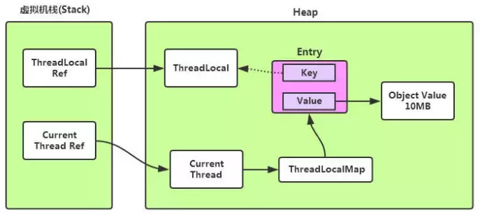

# 一、锁

## 1.1.死锁

死锁的定义：死锁是指两个或两个以上的进程在执行过程中，由于竞争资源或者由于彼此通信而造成的一种阻塞

的现象，若无外力作用，它们都将无法推进下去。

竞争的资源可以是：锁、网络连接、通知事件，磁盘、带宽，以及一切可以被称**资源**的东西。

例子：如果此时有一个线程A，按照先锁a再获得锁b的的顺序获得锁，而在此同时又有另外一个线程B，按照先锁b

再锁a的顺序获得锁。如下图所示：


## 1.2.公平锁/非公平锁

公平锁：指多个线程按照申请锁的顺序获取锁。

非公平锁：指多个线程获取锁的顺序不是按照线程申请锁的顺序；可能后申请的线程比先申请的线程优先获取锁。

```java
//ReentrantLock默认是非公平锁
ReentrantLock lock = new ReentrantLock(true);//公平锁
ReentrantLock lock = new ReentrantLock();    //非公平锁
//非公平锁的优点在于吞吐量比公平锁大
```

```java
//synchronized是一种非公平锁，不是通过AQS来实现线程调度的，所以不能是其变为公平锁
```

>`AQS`是`Abustact Queued Synchronizer`的简称，它是一个`Java`提高的底层同步工具类，用一个`int`类型的变量表示同步状态，并提供了一系列的`CAS`操作来管理这个同步状态

## 1.3.可重入锁/不可重入锁

可重入锁：指可重复递归调用的锁；在外层使用锁之后，在内层还可以使用，并且不发生死锁。

```java
//synchronized、ReentrantLock都是可重入锁
synchronized void setA() throws InterruptedException {
    Thread.sleep(100);
    setB(); //可重复使用同一对象或Class加锁
}

synchronized void setB() throws InterruptedException {
    Thread.sleep(100);
}
```

不可重入锁：与可重入锁相反，不可重复递归；递归调用就发生死锁。

```java
public class UnreenTrantLock {

    private AtomicReference<Thread> owner = new AtomicReference<>();

    public void lock() {
        Thread currentThread = Thread.currentThread();
        //经典的<自旋>语法
        for (; ; ) {
            if (!owner.compareAndSet(null, currentThread)) {
                return;
            }
        }
    }

    public void unlock() {
        Thread currentThread = Thread.currentThread();
        owner.compareAndSet(currentThread, null);
    }
}
```

使用原子性引用来存放线程，同一个线程调用两次lock()方法，若不执行unlock()释放锁，第二次调用自旋是就会产生死锁，这个锁就是不可冲入锁；

实际上同一个线程不必每次都去释放锁再来获取锁，这种调度切换很耗费资源，可将上面的锁变成一个可重入锁。

```java
public class UnreenTrantLock {

    private AtomicReference<Thread> owner = new AtomicReference<>();
    private int state = 0;

    public void lock() {
        Thread currentThread = Thread.currentThread();
        if (currentThread == owner.get()) {
            state++;
            return;
        }
        //经典的<自旋>语法
        for (; ; ) {
            if (!owner.compareAndSet(null, currentThread)) {
                return;
            }
        }
    }

    public void unlock() {
        Thread currentThread = Thread.currentThread();
        if (currentThread == owner.get()) {
            if (state != 0) {
                state--;
            } else {
                owner.compareAndSet(currentThread, null);
            }
        }
    }
}
```

此时在每次执行之前，判断当前锁的持有者是否是当前对象，并采用state计数，不用每次释放锁（即若同一个对象不是加锁多次就不用释放锁）。

```java
//ReentrantLock中可重入锁的实现
final boolean nonfairTryAcquire(int acquires) {
    final Thread current = Thread.currentThread();
    int c = getState();
    if (c == 0) {
        if (compareAndSetState(0, acquires)) {
            setExclusiveOwnerThread(current);
            return true;
        }
    }
    //非公平锁的获取
    else if (current == getExclusiveOwnerThread()) {
        int nextc = c + acquires;
        if (nextc < 0) // overflow
            throw new Error("Maximum lock count exceeded");
        setState(nextc);
        return true;
    }
    return false;
}
```


# 二、`ThreadLocal`(线程本地变量)

`ThreadLocal `是一个本地线程副本变量工具类，主要用于将私有线程和该线程存放的副本对象做一个映射，各个线程之间的变量互不干扰，在高并发场景下，可以实现无状态的调用，适用于**各个线程不共享变量值的操作**。

## 2.1. 工作原理

`ThreadLocal`内部维护的是一个`ThreadLocalMap`(Map（key,value）数据格式)

- `key`是一个弱引用(`ThreadLocal本身`)
- `value`存放的是线程变量的值

即`ThreadLocal `本身并不存储线程的变量，它只是一个工具，用来维护每一个线程内部的`Map`



## 2.2.`ThreadLocal`如何解决`Hash`冲突

与`HashMap`不同，`ThreadLocalMap`结构非常简单，没有`next`引用，所以`ThreadLocalMap`中解决`Hash`冲突的方式并非链表的方式，而是采用线性探测的方式。

线性探测：根据初始`key`的`hashcode`值确定元素在`table`数组中的位置，如果发现这个位置上已经被其他的`key `值占用，则利用固定的算法寻找一定步长的下个位置，依次判断，直至找到能够存放的位置。

```java
/
 * Increment i modulo len.
 */
private static int nextIndex(int i, int len) {
    return ((i + 1 < len) ? i + 1 : 0);
}

/
 * Decrement i modulo len.
 */
private static int prevIndex(int i, int len) {
    return ((i - 1 >= 0) ? i - 1 : len - 1);
}
```

## 2.3.`ThreadLocal`内存泄露的原因

`ThreadLocal`中的`ThreadLocalMap`是以一个弱引用身份被`Entry`中的`Key`引用，因此如果`ThreadLocal`没有外部的强应用来引用它，那么下次`JVM`垃圾回收机制运行时，会回收掉`ThreadLocal`；

此时`Entry`中的`key`已经被回收，但是`value`是一个强引用，垃圾收集器不能回收，这样就造成`ThreadLocal`线程如果一直运行，`value`就不能回收，从而造成内存泄漏。

## 2.4.`ThreadLocalMap`的`key`为什么是弱引用

- 若`key`使用强引用，会存在一个问题，当引用的`ThreadLocal`的对象被回收了，但是`ThreadLocalMap`还持有 `ThreadLocal`的强引用，如果没有手动删除，`ThreadLocal`不会被回收，则会导致内存泄漏。

- 若`key`使用弱引用，当引用的`ThreadLocal`的对象被回收了，由于`ThreadLocalMap`持有`ThreadLocal`的弱引用，即使没有手动删除，`ThreadLocal`也会被回收。`value`在下一次`ThreadLocalMap`调用`set、get、remove` 的时候会被清除。

比较以上两种情况，可发现：由于`ThreadLocalMap`的生命周期跟`Thread`一样长，如果都没有手动删除对应`key`，都会导致内存泄漏，但是使用弱引用可以多一层保障，弱引用`ThreadLocal`不会内存泄漏，对应的`value`在下一次`ThreadLocalMap`调用`set、get、remove`的时候被清除，算是最优的解决方案。

## 2.5.`ThreadLocal`的应用场景

`ThreadLocal`适用于独立变量副本的情况，比如`Hibernate`的`session`获取场景

```java
private static final ThreadLocal<Session> threadLocal = new ThreadLocal<Session>();

public static Session getCurrentSession(){
    Session session =  threadLocal.get();
    try {
        if(session ==null&&!session.isOpen()){
            //...
        }
        threadLocal.set(session);
    } catch (Exception e) {
        // TODO: handle exception
    }
    return session;
}
```

## 2.6.`ThreadLocal`的方法

- `T get()`:获取`ThreadLocal`在当前线程中保存的变量副本
- `void set(T value)`:设置当前线程中变量的副本
- `void remove()`:移除当前线程中变量的副本
- `protected T initialValue()`:一个`protected`方法，一般是用来在使用时进行重写的，它是一个延迟加载方法

```java
//默认情况，没有先set，直接get的话，运行时会报空指针异常
//重写initialValue后，可不先set
public class Test {
    ThreadLocal<Long> longLocal = new ThreadLocal<Long>(){
        protected Long initialValue() {
            return Thread.currentThread().getId();
        };
    };
    ThreadLocal<String> stringLocal = new ThreadLocal<String>(){;
        protected String initialValue() {
            return Thread.currentThread().getName();
        };
    };
 
     
    public void set() {
        longLocal.set(Thread.currentThread().getId());
        stringLocal.set(Thread.currentThread().getName());
    }
     
    public long getLong() {
        return longLocal.get();
    }
     
    public String getString() {
        return stringLocal.get();
    }
     
    public static void main(String[] args) throws InterruptedException {
        final Test test = new Test();
 
        test.set();
        System.out.println(test.getLong());
        System.out.println(test.getString());
     
         
        Thread thread1 = new Thread(){
            public void run() {
                test.set();
                System.out.println(test.getLong());
                System.out.println(test.getString());
            };
        };
        thread1.start();
        thread1.join();
         
        System.out.println(test.getLong());
        System.out.println(test.getString());
    }
}
```

> 通过`ThreadLocal`创建的副本是存储在每个线程自己的`threadLocals`中的

[^参考]: https://www.cnblogs.com/dolphin0520/p/3920407.html


# 三、线程的实现方式

## 3.1.继承`Thread`

```java
public class MyThread extends Thread {

    @Override
    public void run() {
        System.out.println("extends Thread");
    }
}
```

```java
MyThread thread = new MyThread();
thread.start();
```

## 3.2.实现`Runable`接口

```java
public class MyRunnable implements Runnable {
    @Override
    public void run() {
        System.out.println("implements Runnable");
    }
}
```

```java
MyRunnable runnable = new MyRunnable();
Thread thread1 = new Thread(runnable);
thread1.start();
```

## 3.3.通过`ExecutorService、Callable、Future`

`ExecutorService、Callable、Future`三个接口实际上都是属于`Executor`框架

- 返回值的任务必须实现`Callable`接口
- 无返回值的任务必须实现`Runnable`接口

```java
public class MyCallable implements Callable {

    private int taskNum;

    public MyCallable() {
    }

    public MyCallable(int taskNum) {
        this.taskNum = taskNum;
    }

    @Override
    public Object call() throws Exception {
        Thread.sleep(1000);
        return new User("u00" + taskNum);
    }
}
```

```java
//有返回值的任务
int taskSize = 5;
//创建线程池
ExecutorService executor = Executors.newFixedThreadPool(taskSize);
//创建多个有返回值的任务
ArrayList<Future> futures = new ArrayList<>();
for (int i = 0; i < taskSize; i++) {
    MyCallable callable = new MyCallable(i);
    //执行任务，返回future
    Future future = executor.submit(callable);
    futures.add(future);
}
//关闭线程池
executor.shutdown();
//获取所有并发任务返回的结果
for (Future f : futures) {
    //线程的返回值
    Object o = f.get();
    System.out.println(o);
}
```


## 3.4.实现`Callable`接口通过`FutureTask`包装器

```java
public class MyCallable implements Callable {

    @Override
    public Object call() throws Exception {
        System.out.println("implements Callable");
        return new User();
    }
}
```

```java
MyCallable callable = new MyCallable();
FutureTask futureTask = new FutureTask(callable);
Thread thread2 = new Thread(futureTask);
thread2.start();
```


# 四、线程的常用方法

- `notify()`
- `wait()` 
- `yield()`
- `join()`


