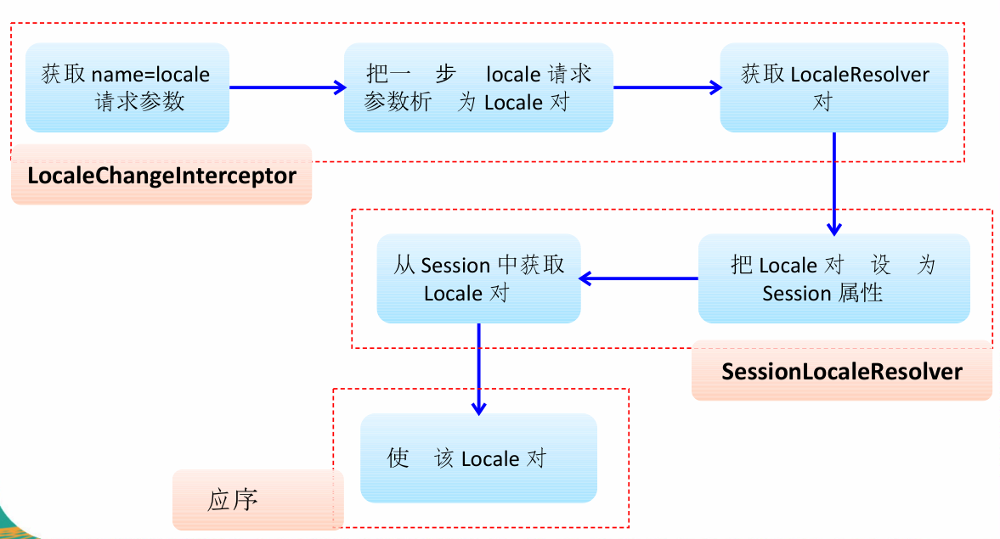

# 一、构建springmvc项目

## 1.1.依赖的jar

```xml

```

## 1.2.配置springmvc.xml

```xml
<?xml version="1.0" encoding="UTF-8"?>
<beans xmlns="http://www.springframework.org/schema/beans"
       xmlns:xsi="http://www.w3.org/2001/XMLSchema-instance"
       xmlns:context="http://www.springframework.org/schema/context"
       xmlns:mvc="http://www.springframework.org/schema/mvc"
       xsi:schemaLocation="http://www.springframework.org/schema/mvc 
                           http://www.springframework.org/schema/mvc/spring-mvc-4.0.xsd
					     http://www.springframework.org/schema/beans 
                           http://www.springframework.org/schema/beans/spring-beans.xsd
						 http://www.springframework.org/schema/context 
                           http://www.springframework.org/schema/context/spring-context-4.0.xsd">

    <!--SpringMVC只是控制网站跳转逻辑  -->
    <!-- 只扫描控制器 -->
    <context:component-scan base-package="com.xy.controller"></context:component-scan>

    <!-- 视图解析器 -->
    <bean class="org.springframework.web.servlet.view.InternalResourceViewResolver">
        <property name="prefix" value="/WEB-INF/pages/"></property>
        <property name="suffix" value=".jsp"></property>
    </bean>

    <!--开启mvc注解-->
    <mvc:annotation-driven></mvc:annotation-driven>
    
    <!--处理静态资源 -->
    <mvc:default-servlet-handler/>
    
    <!-- 配置国际化资源文件 -->
	<bean id="messageSource"
		class="org.springframework.context.support.ResourceBundleMessageSource">
		<property name="basename" value="i18n"></property>	
	</bean>
	
	<!-- 配置直接转发的页面 -->
	<!-- 可以直接相应转发的页面, 而无需再经过 Handler 的方法.  -->
	<mvc:view-controller path="/success" view-name="success"/>
</beans>

```

## 1.3.配置web.xml

```xml
<?xml version="1.0" encoding="ISO-8859-1"?>
<web-app xmlns="http://java.sun.com/xml/ns/javaee"
         xmlns:xsi="http://www.w3.org/2001/XMLSchema-instance"
         xsi:schemaLocation="http://java.sun.com/xml/ns/javaee
                      http://java.sun.com/xml/ns/javaee/web-app_3_0.xsd"
         version="3.0">
    <display-name>SSM</display-name>

    <!--Spring配置： needed for ContextLoaderListener -->
    <context-param>
        <param-name>contextConfigLocation</param-name>
        <param-value>classpath:applicationContext.xml</param-value>
    </context-param>

    <!--配置上下文监听-->
    <listener>
        <listener-class>org.springframework.web.context.ContextLoaderListener</listener-class>
    </listener>

    <!--SpringMVC转发器-->
    <servlet>
        <servlet-name>springmvc</servlet-name>
        <servlet-class>org.springframework.web.servlet.DispatcherServlet</servlet-class>
        <!--配置springmvc配置文件位置，默认位置WEB-INF/springmvc-servlet.xml
		   默认的配置文件：/WEB-INF/<servlet-name>-servlet.xml
		   此处的默认配置文件：/WEB-INF/springmvc-servlet.xml-->
        <init-param>
            <param-name>contextConfigLocation</param-name>
            <param-value>classpath:springmvc.xml</param-value>
        </init-param>
        <load-on-startup>1</load-on-startup>
    </servlet>

    <!--SpringMVC处理的资源-->
    <servlet-mapping>
        <servlet-name>springmvc</servlet-name>
        <url-pattern>/</url-pattern>
    </servlet-mapping>
    
    <!--配置过滤器HiddenHttpMethodFilter,处理将POST请求转化为DELET请求和PUT请求-->
    <filter>
        <filter-name>HiddenHttpMethodFilter</filter-name>
        <filter-class>org.springframework.web.filter.HiddenHttpMethodFilter</filter-class>
    </filter>

    <filter-mapping>
        <filter-name>HiddenHttpMethodFilter</filter-name>
        <url-pattern>/*</url-pattern>
    </filter-mapping>
    
</web-app>
```


# 二、常用注解

## 2.1.`@RequestMapping`

`@RequestMapping`可以设置在方法和类上，设置请求映射的路径;

* 通过URL的方式映射请求

```java
@RequestMapping("/userController")
@Controller
public class UserController{ 
    @RequestMapping(/get)
    public User get(){
        
    }
}
```

* 通过请求头、请求参数、请求方法的方式映射请求
  * `method = RequestMethod.POST`:设置请求方式
  * `params = {},headers = {}`设置请求参数和请求头，支持简单的表达式
    * `param1`:表示请求必须包含param1参数
    * `!param1`:表示请求不能包含param1参数
    * `param1!=value1`:表示请求中参数param1的值不能等于value1
    * `{"param1=value1","param2"}`:表示请求中必须包含参数param1和param2,且参数param1的值必须是value1

```java
//method 设置请求方式
@RequestMapping(value = "/getListEmp",method = RequestMethod.POST)
public String getListEmp(){

    return "list";
}
```

```java
//params设置请求参数，必须包含参数username和password，且password的值不能等于1234
//headers设置请求头
@RequestMapping(value = "login",params = {"username","password!=1234"},headers = {"Accept-Language=zh_CN,zh,q=0.8"})
public String login(){

    return "";
}
```

* @RequestMapping支持Ant风格的通配符
  * `[*]`:匹配任意字符
  * `[?]`:匹配一个字符
  * `[**]`:匹配多层路径

```java
@RequestMapping("/*/login")
public String login(){
    return "";
}
```

```html
<a href="admin/login">登录</a>
```

## 2.2.`@PathVariable`

`@PathVariable`映射URL绑定的占位符到目标方法的参数中，是Spring3.0后新增的功能

```java
@RequestMapping("/login/{username}")
public String login(@PathVariable("username") String username,Model model){
    model.addAttribute("username",username);
    return "main";
}
```

```html
<a href="${pageContext.request.contextPath}/login/zhangsan">登录</a>
```

## 2.3.`@RequestParam`

`@RequestParam`请求参数的绑定

- `required`设置参数是否必须 
- `defaultValue`设置请求参数默认值

```html\
<a href="${pageContext.request.contextPath}/login?username=zhangsan&password=1234">登录</a>
```

```java
//required设置参数是否必须
@RequestMapping("/login")
public String login(@RequestParam("username") String username,@RequestParam(value = "password",required = false) String password, Model model){
    model.addAttribute("username",username);
    model.addAttribute("password",password);
    return "main";
}
```

```java
//若参数为基本数据类型，不传值是需设置默认值，或修改为包装类型
@RequestMapping("/register")
public String register(@RequestParam(value = "password",required = false,defaultValue = "0") int age, Model model){
    model.addAttribute("age",age);
    return "main";
}
```

## 2.4.`@RequestHeader`

`@RequestHeader`设置请求头参数

- `required`设置参数是否必须 
- `defaultValue`设置请求参数默认值

```html
<a href="${pageContext.request.contextPath}/register?Accept-Language = zh_CN">注册</a>
```

```java
//@RequestHeader 设置请求头参数 Accept-Language: zh-CN,zh;q=0.9
@RequestMapping("/register")
public String register(@RequestHeader("Accept-Language") String al, Model model){
    model.addAttribute("al",al);
    return "main";
}
```

## 2.5.`@CookieValue`

`@CookieValue`绑定`Cookie`值

```html
<a href="${pageContext.request.contextPath}/register">注册</a>
```

```java
//@CookieValue 映射cookie值
@RequestMapping("/register")
public String register(@CookieValue("JSESSIONID") String sessionId, Model model){
    model.addAttribute("sessionId",sessionId);
    return "main";
}
```

## 2.6.`@SessionAttribute`


## 2.7.`@SessionAttributes`

`@SessionAttributes`将值放在`session`域中，即可以通过属性名指定放入的属性(value)，也可以通过模型属性的对象类型指定放入的属性`(type)`只能作用在类上面

```java
@Controller
//@SessionAttributes 将值放在session域中，即可以通过属性名指定放入的属性，也可以通过模型属性的对象类型指定放入的属性
@SessionAttributes(value = {"user"},types = {String.class})
public class EmpController {

    @RequestMapping("/register")
    public String register(Map<String,Object> map){
        User user = new User("zhangsan","1234","zhangsna@yinhai.com");
        map.put("user",user);
        map.put("school","sichaundaxue");
        return "main";
    }
}
```

## 2.8.`@ModelAttribute`

`@ModelAttribute`可以修改方法；也可以修饰目标方法的POJO类型的入参，value指定查找的key

```java
//@ModelAttribute 标记的方法，会在每个目标方法之前执行
@ModelAttribute
public void getUser(@RequestParam("id") String id,Map<String,Object> map){
    if(id != null){
        User user = new User(1,"zhangsan","12345","zhangsan@yinhai.com");
        System.out.println("先从数据库获取值:"+user);
        //注意：若没有在入参中标注@ModelAttribute,键应该是目标方法入参类型的首字母小写	
        //若标注了@ModelAttribute，则key为@ModelAttribute中value值
        map.put("user",user);
    }
}

@RequestMapping("/updateUser")
public String updateUser(@ModelAttribute("user") User user){
    System.out.println("修改信息:"+user);
    return "main";
}
```

### 2.8.1.运行流程：

1. 执行`@ModelAttribute`标注的方法，从数据库中取出对象，将值放入到Map中（键：user）
2. SpringMVC从Map值取出User对象，并把表单的请求参数赋值给该User对象的对应属性
3. SpringMVC把上述的对象传入目标对象

效果：修改数据时，没有传入需要修改的值时，默认取数据库中原来的值

### 2.8.2.源码分析


### 2.8.3.SpringMVC确定目标方法POJO类型参数的过程

1. 确定一个key
   * 若目标方法POJO类型参数没有使用@ModelAttribute修饰，则key为POJO类名首字母小写
   * 若目标方法POJO类型参数使用@ModelAttribute修饰，则key为@ModelAttribute注解的value值
2. 在implicitModel中查找key对应的对象，若存在，就作为入参传入
3. 在implicitModel中不存在key对应的对象，则检查当前Handler是否标注了@SessionAttributes注解
   * 若标注了@SessionAttributes注解，则在该注解的value中查找是否包含key
     * 若存在就从HttpSession中取出key对应的值，传入目标方法的入参
     * 若key取出的值不存在就抛出异常
   * 若没有标注@SessionAttributes注解或@SessionAttributes注解的value中不包含key,则通过反射创建POJO类型的参数，传入目标方法的入参
4. SpringMVC 会将key和value（POJO类型的对象）保存到implicitModel中，进而保存到request中。

## 2.9.`@InitBinder`

`@InitBinder`标注在方法上，对WebDataBinder进行初始化

* WebDataBinder是DataBinder的子类，作用是完成表单字段到JavaBean属性的绑定
* initBinder()方法的没有返回值
* initBinder()方法的参数一般是WebDataBinder

```java
//在保存之前，设置不绑定ename的值
@InitBinder
public void initBinder(WebDataBinder binder){
    //设置某个字段不赋值
    binder.setDisallowedFields("ename");
    //用于自定义设置参数的绑定
}
```

## 2.10.`@NumberFormat`

`NumberFormatAnnotationFormatterFactory`支持`@NumberFormat`

- 将字符串`(1,263,383.2)`转化为数字

```jsp
<form:input path="salary"/>
```

```java
@NumberFormat(pattern="#,###,###.#")
private Float salary;
```


## 2.11.`@DateTimeFormat`

`JodaDateTimeFormatAnnotationFormatterFactory`支持`@DateTimeFormat`

- 将日期字符串转化为日期

```jsp
<form:input path="birth"/>
```

```java
@Past
@DateTimeFormat(pattern="yyyy-MM-dd")
private Date birth;
```


# 三、`Rest`

* `GET`:获取资源
* `POST`:新建资源
* `PUT`:更新资源
* `DELETE`:删除资源

## 3.1.POST请求转REST风格的请求

由于浏览器的`form`表单只支持`GTE`和`POST`请求，`HiddenHttpMethodFilter`支持这些请求转换为标准的`http`方法，从而支持`GET,POST,PUT,DELETE`请求

```xml
<!--配置过滤器HiddenHttpMethodFilter-->
<filter>
    <filter-name>HiddenHttpMethodFilter</filter-name>
    <filter-class>org.springframework.web.filter.HiddenHttpMethodFilter</filter-class>
</filter>

<filter-mapping>
    <filter-name>HiddenHttpMethodFilter</filter-name>
    <url-pattern>/*</url-pattern>
</filter-mapping>
```

```html

```

## 3.2.处理静态资源

问题：

   优雅的Rest风格的URL不希望带.html或.do等后缀，若将DispathcerServlet请求映射配置为`/`，SpringMVC会拦截Web容器所有的请求（包括静态资源的请求），SpringMVC将其当做一个普通的请求处理，因此找不到对应的处理器处理，故找不到资源。

解决方案：

```xml
<!-- 处理静态资源 -->
<mvc:default-servlet-handler/>
<!-- 其他请求可用-->
<mvc:annotation-driven></mvc:annotation-driven>
```

`<mvc:default-servlet-handler/>`将在SpringMVC的上下文定义一个DefaultServletHttpRequestHandler,它会对进入DispatcherServlet的请求进行筛选;

* 若发现没有经过映射请求，就将该请求交由Web应用服务器默认的Servlet处理
* 若不是静态资源的请求，才由DispatcherServlet继续处理

一般Web应用服务器默认的Servlet的名称时default，若Web应用服务器默认的Servlet不是default，可使用default-servlet-name修改

```xml
<mvc:default-servlet-handler default-servlet-name="default"/>
```

## 3.3.REST风格的CRUD

1.springmvc的配置文件springnvc.xml

```xml
<?xml version="1.0" encoding="UTF-8"?>
<beans xmlns="http://www.springframework.org/schema/beans"
       xmlns:xsi="http://www.w3.org/2001/XMLSchema-instance"
       xmlns:context="http://www.springframework.org/schema/context"
       xmlns:mvc="http://www.springframework.org/schema/mvc"
       xsi:schemaLocation="http://www.springframework.org/schema/mvc http://www.springframework.org/schema/mvc/spring-mvc-4.0.xsd
		http://www.springframework.org/schema/beans http://www.springframework.org/schema/beans/spring-beans.xsd
		http://www.springframework.org/schema/context http://www.springframework.org/schema/context/spring-context-4.0.xsd">

    <!--SpringMVC只是控制网站跳转逻辑  -->
    <!-- 只扫描控制器 -->
    <context:component-scan base-package="com.xy.controller"></context:component-scan>

    <!-- 视图解析器 -->
    <bean class="org.springframework.web.servlet.view.InternalResourceViewResolver">
        <property name="prefix" value="/WEB-INF/pages/"></property>
        <property name="suffix" value=".jsp"></property>
    </bean>

    <!--配置BeanNameViewResolver视图解析：根据视图名称解析视图-->
    <bean id="beanNameViewResolver" class="org.springframework.web.servlet.view.BeanNameViewResolver">
        <!--设置视图的优先级，值越小优先级越高；常用的视图解析器的优先级低，即其他视图解析器解析不了，再使用常用的视图解析器解析-->
        <property name="order" value="100"></property>
    </bean>

    <!-- 处理静态资源 -->
    <mvc:default-servlet-handler/>
    <!-- 其他请求可用-->
    <mvc:annotation-driven></mvc:annotation-driven>
    
</beans>
```

2.mapper层

```java
public interface EmpMapper extends BaseMapper<Emp> {

    //查询某一部门下的所有人员
    List<Emp> getByDeptName(RowBounds rowBounds, @Param("ew")Wrapper<Emp> wrapper);
}
```

3.service层

```java
public interface EmpService extends IService<Emp> {

}
```

```java
@Service
public class EmpServiceImpl extends ServiceImpl<EmpMapper, Emp> implements EmpService {

}
```

4.controller层

```java
@Controller
@RequestMapping("/emp")
public class EmpController {

    @Autowired
    private EmpService empService;

    @Autowired
    private DeptService deptService;

    //查询人员列表
    @RequestMapping(value = "/emps")
    public String list(Map<String,Object> map){
        List<Emp> empList = empService.selectList(null);
        map.put("emps",empList);
        return "list";
    }

    //进入新增页面
    @RequestMapping(value = "/emp",method = RequestMethod.GET)
    public String input(Map<String,Object> map){
        map.put("depts",deptService.selectList(null));
        map.put("emp",new Emp());
        map.put("emps",empService.selectList(null));
        return "input";
    }

    //保存信息
    @RequestMapping(value = "/emp",method = RequestMethod.POST)
    public String insert(Emp emp){
        boolean insert = empService.insert(emp);
        return "redirect:emps";
    }

    //进入修改页面
    @RequestMapping(value = "/emp/{empno}",method = RequestMethod.GET)
    public String input(@PathVariable("empno") Integer empno, Map<String,Object> map){
        Emp emp = empService.selectById(empno);
        map.put("emp",emp);
        map.put("depts",deptService.selectList(null));
        map.put("emps",empService.selectList(null));
        return "input";
    }

    //修改前获取数据库的数据
    @ModelAttribute
    public void get(@RequestParam(value = "empno",required = false) Integer empno, Map<String,Object> map){
        if(empno != null){
            map.put("emp",empService.selectById(empno));
        }
    }

    //修改信息
    @RequestMapping(value = "/emp",method = RequestMethod.PUT)
    public String update(Emp emp){
        empService.updateById(emp);
        return "redirect:emps";
    }

    //删除信息
    @RequestMapping(value = "/emp/{empno}",method = RequestMethod.DELETE)
    public String delete(@PathVariable("empno") BigDecimal empno){
        boolean delete = empService.deleteById(empno);
        return "redirect:/emp/emps";
        //return "redirect:emps";
    }

}
```

5. 页面list.jsp

```jsp
<%@ page language="java" contentType="text/html; charset=UTF-8" pageEncoding="UTF-8" isELIgnored="false"%>
<%@taglib prefix="c" uri="http://java.sun.com/jsp/jstl/core" %>
<%@ taglib prefix="form" uri="http://www.springframework.org/tags/form" %>
<html>
<head>
    <title>员工列表</title>
    <%--引入静态资源文件--%>
    <script type="text/javascript" src="${pageContext.request.contextPath}/js/jquery-3.1.1.js"></script>
    <script type="text/javascript">
        //删除的post请求转DELETE请求
        $(function(){
            $(".delete").click(function(){
                var href = $(this).attr("href");
                $("form").attr("action", href).submit();
                //阻止a标签的href的默认行为
                return false;
            });
        })
    </script>
</head>
<body>
    
    <form:form action="" method="post">
        <%--注意：对于_method不能使用form:hidden标签, 因为modelAttribute对应的bean中没有_method 这个属性--%>
        <input type="hidden" name="_method" value="DELETE">
    </form:form>

    <table border="1">
        <tr>
            <th>序号</th>
            <th>empno</th>
            <th>ename</th>
            <th>job</th>
            <th>mgr</th>
            <th>hiredate</th>
            <th>sal</th>
            <th>comm</th>
            <th>deptno</th>
            <th>修改</th>
            <th>删除</th>
        </tr>
        <c:forEach items="${requestScope.emps}" var="emp" varStatus="status">
            <tr>
                <td>${status.index}</td>
                <td>${emp.empno}</td>
                <td>${emp.ename}</td>
                <td>${emp.job}</td>
                <td>${emp.mgr}</td>
                <td>${emp.hiredate}</td>
                <td>${emp.sal}</td>
                <td>${emp.comm}</td>
                <td>${emp.deptno}</td>
                <td><a href="${pageContext.request.contextPath}/emp/emp/${emp.empno}">修改</a></td>
                <td><a class="delete" href="${pageContext.request.contextPath}/emp/emp/${emp.empno}">删除</a></td>
            </tr>
        </c:forEach>
    </table>

<a href="${pageContext.request.contextPath}/emp/emp">新增</a>
</body>
</html>
```

6.页面input.jsp

```jsp
<%@ page language="java" contentType="text/html; charset=UTF-8" pageEncoding="UTF-8" isELIgnored="false"%>
<%@taglib prefix="c" uri="http://java.sun.com/jsp/jstl/core" %>
<%@taglib prefix="form" uri="http://www.springframework.org/tags/form" %>
<html>
<head>
    <title>员工新增</title>
</head>
<body>
    <form:form id="emp" action="${pageContext.request.contextPath}/emp/emp" method="post" modelAttribute="emp">
        <input type="hidden" name="_method" value="PUT">
        <c:if test="${emp.empno != null}">
            <form:hidden path="empno"/><br>
        </c:if>
        <c:if test="${emp.empno == null}">
            编号：<form:input path="empno"/>
        </c:if>
        <%--path 等同于html中input标签的path--%>
        姓名：<form:input path="ename"/><br>
        工作：<form:input path="job"/><br>
        上级：<form:select path="mgr" items="${emps}" itemLabel="ename" itemValue="empno"/><br>
        <%--入职时间：<form:input path="hiredate"/><br>--%>
        工资：<form:input path="sal"/><br>
        奖金：<form:input path="comm"/><br>
        部门：<form:select path="dept.deptno" items="${depts}" itemLabel="dname" itemValue="deptno"/><br>
        <input type="submit" value="提交"/>
    </form:form>
</body>
</html>
```

7.web.xml

```xml
<?xml version="1.0" encoding="UTF-8"?>
<web-app xmlns:xsi="http://www.w3.org/2001/XMLSchema-instance"
	xmlns="http://java.sun.com/xml/ns/javaee"
	xsi:schemaLocation="http://java.sun.com/xml/ns/javaee http://java.sun.com/xml/ns/javaee/web-app_2_5.xsd"
	id="WebApp_ID" version="2.5">

	<!-- 配置 SpringMVC 的 DispatcherServlet -->
	<!-- The front controller of this Spring Web application, responsible for handling all application requests -->
	<servlet>
		<servlet-name>springDispatcherServlet</servlet-name>
		<servlet-class>org.springframework.web.servlet.DispatcherServlet</servlet-class>
		<init-param>
			<param-name>contextConfigLocation</param-name>
			<param-value>classpath:springmvc.xml</param-value>
		</init-param>
		<load-on-startup>1</load-on-startup>
	</servlet>

	<!-- Map all requests to the DispatcherServlet for handling -->
	<servlet-mapping>
		<servlet-name>springDispatcherServlet</servlet-name>
		<url-pattern>/</url-pattern>
	</servlet-mapping>
	
	<!-- 配置 HiddenHttpMethodFilter: 把 POST 请求转为 DELETE、PUT 请求 -->
	<filter>
		<filter-name>HiddenHttpMethodFilter</filter-name>
		<filter-class>org.springframework.web.filter.HiddenHttpMethodFilter</filter-class>
	</filter>
	
	<filter-mapping>
		<filter-name>HiddenHttpMethodFilter</filter-name>
		<url-pattern>/*</url-pattern>
	</filter-mapping>

</web-app>
```


# 四、参数的绑定

## 4.1.`@RequestParam`绑定参数

```java
@RequestMapping("/login")
public String login(@RequestParam("username") String username,@RequestParam(value = "password",required = false) String password, Model model){
    model.addAttribute("username",username);
    model.addAttribute("password",password);
    return "main";
}
```

## 4.2.绑定POJO参数

- 请求参数与`POJO`属性名自动匹配，自动为对象填充属性值，支持级联属性

```html
<form action="${pageContext.request.contextPath}/register" method="post">
    用户名：<input type="text" name="username">
    密  码：<input type="password" name="password">
    邮  箱：<input type="email" name="email">
    <!--使用级联属性-->
    地  址(省)：<input type="text" name="address.province">
    地  址(市)：<input type="text" name="address.city">
    <input type="submit" value="注册">
</form>
```

```java
public class User {

    private String username;
    private String password;
    private String email;
    private Address address;
    ...
}
```

```java
public class Address {
    private String province;
    private String city;
    ...
}
```

```java
@RequestMapping("/register")
public String register(User user, Model model){
    model.addAttribute("user",user);
    return "main";
}
```

## 4.3.设置`SerlvetAPI`类型的参数

通过`AnnotationMethodHandlerAdapter.resolveStandardArgument()`进行解析，支持的`SerlvetAPI`类型有：

| 类型                      | 描述 |
| ------------------------- | ---- |
| `HttpServletRequest`      |      |
| `HttpSerlvetResponse`     |      |
| `HttpSession`             |      |
| `java.security.Principal` |      |
| `Local`                   |      |
| `InputStream`             |      |
| `OutputStream`            |      |
| `Reader`                  |      |
| `Writer`                  |      |

```html
<a href="${pageContext.request.contextPath}/register">注册</a>
```

```java
@RequestMapping("/register")
public String register(HttpServletRequest request, HttpServletResponse response, Model model){
    model.addAttribute("request",request);
    model.addAttribute("response",response);
    return "main";
}
```


# 五、模型数据的设置

## 5.1.`Model/Map`

实际上最后传入的是`org.springframework.validation.support.BindingAwareModelMap`，所以可以传入`Map`或`Model`类型


```java
@RequestMapping("/register")
public String register(User user,Map<String,Object> map){
    map.put("user",user);
    return "main";
}
```

```java
@RequestMapping("/register")
public String register(User user,Model model){
    model.addAttribute("user",user);
    return "main";
}
```

## 5.2.`ModelAndView`

-  `ModelAndView`既包含视图信息，也包含模型数据
- `ModelAndView`会把`Model`中的数据放入到`request`中

```java
@RequestMapping("/register")
public ModelAndView register(User user,HttpServletRequest request){
    ModelAndView modelAndView = new ModelAndView();
    modelAndView.addObject("user",user);
    modelAndView.setViewName("main");
    return modelAndView;
}
```

## 5.3.`HttpServletRequest`

```java
@RequestMapping("/register")
public String register(User user,HttpServletRequest request){
    request.setAttribute("user",user);
    return "main";
}
```

## 5.4.`@SessionAttributes`

- 多个请求之间共享某个模型数据，可以使用`@SessionAttributes`

- `@SessionAttributes`可以通过属性名指定放入的属性(value)，也可以通过模型属性的对象类型指定放入的属性(type)，它会将满足的条件的值放入到`session`中
- 只能标注在类上面

```java
@Controller
//@SessionAttributes 将值放在session域中，即可以通过属性名指定放入的属性，也可以通过模型属性的对象类型指定放入的属性
@SessionAttributes(value = {"user"},types = {String.class})
public class EmpController {

    @RequestMapping("/register")
    public String register(Map<String,Object> map){
        User user = new User("zhangsan","1234","zhangsna@yinhai.com");
        map.put("user",user);
        map.put("school","sichaundaxue");
        return "main";
    }
}
```

## 5.5.`@ModelAttribute`

- `@ModelAttribute`入参标注该注解，入参对象就会放入数据模型中
- `@ModelAttribute`标记的方法会在每个目标方法执行前执行

```java
//修改前获取数据库的数据
@ModelAttribute
public void get(@RequestParam(value = "empno",required = false) Integer empno, Map<String,Object> map){
    if(empno != null){
        //此时Map的键要与目标方法入参类型首字母小写
        map.put("emp",empService.selectById(empno));
    }
}
//修改信息
@RequestMapping(value = "/emp",method = RequestMethod.PUT)
public String update(Emp emp){
    empService.updateById(emp);
    return "redirect:emps";
}
```

- `@ModelAttribute`可以修饰可以来修饰目标方法POJO类型的入参，其value属性值有如下的作用:
  1). SpringMVC会使用value属性值在implicitModel中查找对应的对象，若存在则会直接传入到目标方法的入参中。
  2). SpringMVC会value为key，POJO类型的对象为value，存入到request中。

```java
@ModelAttribute
public void get(@RequestParam(value = "empno",required = false) Integer empno, Map<String,Object> map){
    if(empno != null){
        //此时Map的键要与目标方法入参类型@ModelAttribute("user")设置的一致
        map.put("user",empService.selectById(empno));
    }
}
@RequestMapping(value = "/emp",method = RequestMethod.PUT)
public String update(@ModelAttribute("user") Emp emp){
    empService.updateById(emp);
    return "redirect:emps";
}
```

- 执行流程
  - 执行`@ModelAttribute`标注的方法，并将对象放入Map中
  - 从Map中取出emp对象，并将表单的目标参数赋值给emp对象
  - 将emp传入目标方法的参数

```java

```

### 5.5.1.源码分析

- 调用`@ModelAttribute`标注的方法，实际是把`Map`中的数据放入到`implicitModel`中 

- 解析请求处理器的目标参数，实际上该目标参数来自与`WebDataBinder`对象的`target`属性

  1. 创建`WebDataBinder`对象

  - 确定`objectName`属性
    - 若传入的`attrName`属性值为`""`，则`objectName`为类名首字母小写
    - 若目标目标方法的`POJO`属性使用`@ModelAttribute`修饰，则`attrName`值为`@ModelAttribute`的`value`属性值
  - 确定`target`属性
    - 首先在`implicitModel `中查找 `attrName `对应的属性值，若存在就ok
    - 若不存在，则验证当前 `Handler `是否使用了` @SessionAttributes `进行修饰，若使用了，则尝试从 `Session `中获取 `attrName `所对应的属性值，若 `session `中没有对应的属性值，则抛出了异常
    - 若 `Handler `没有使用` @SessionAttributes `进行修饰, 或` @SessionAttributes` 中没有使用 `value `值指定的 `key`和 `attrName `相匹配，则通过反射创建了 `POJO `对象

  2. `SpringMVC `把表单的请求参数赋给了`WebDataBinder `的 `target `对应的属性
  3. `SpringMVC `会把`WebDataBinder `的`attrName `和 `target `给到 `implicitModel`，近而传`request `域对象中
  4. 把 `WebDataBinder `的 `target `作为参数传递给目标方法的入参

## 5.6.`SpringMVC `确定目标方法`POJO `类型入参的过程

1. 确定一个key:
    1). 若目标方法的POJO类型的参数没有使用@ModelAttribute作为修饰， 则key为POJO类名第一个字母的小写
    2). 若使用了@ModelAttribute来修饰， 则key为@ModelAttribute注解的value属性值.
2. 在implicitModel中查找key对应的对象， 若存在， 则作为入参传入
   1). 若在@ModelAttribute标记的方法中在 Map 中保存过， 且key和`(1.确定一个 key)`确定的key一致， 则会获取到.
3. 若 implicitModel中不存在key对应的对象， 则检查当前的Handler是否使用@SessionAttributes 注解修饰，若使用了该注解， 且@SessionAttributes注解的value属性值中包含了key， 则会 HttpSession中来获取key所对应的 alue值， 若存在则直接传入到目标方法的入参中. 若不存在则将抛出异常.
4. 若Handler没有标识@SessionAttributes 注解或@SessionAttributes注解的value值中不包含 key， 则会通过反射来创建POJO类型的参数， 传入为目标方法的参数
5. SpringMVC会把key和POJO类型的对象保存到mplicitModel中， 进而会保存到request中. 

# 六、视图与视图解析器

- 请求方法执行完成后，最终返回一个`ModelAndView`对象。无论方法返回的是`String、View、ModelMap`等那种类型，`SpringMVC`内部都会将其装配成`ModelAndView`对象返回。
- `SpringMVC`通过视图解析器`ViewResolver`等到最终的视图，视图可以是`JSP、Excel、JFreeChart`等各种视图。
- 视图的作用是渲染模型数据，将模型中的数据以某种形式呈现给客户。
- 视图对象有视图解析器负责实例化，由于视图没有状态，所有视图是线程安全的。

## 6.1.配置直接转发

```xml
<!--配置直接转发的页面，无需在经过Handler-->
<mvc:view-controller path="/success" view-name="success"/>
<!--注意：配置了该映射方式，还需要@RequestMapping起作用，需要配置mvc:annotation-driven-->
<mvc:annotation-driven></mvc:annotation-driven>
```

## 6.2.自定义视图

- `order`设置视图优先级，值越小优先级越高

```xml
<!-- 视图解析器 -->
<bean class="org.springframework.web.servlet.view.InternalResourceViewResolver">
    <property name="prefix" value="/WEB-INF/pages/"></property>
    <property name="suffix" value=".jsp"></property>
</bean>
<!--配置BeanNameViewResolver视图解析：根据视图名称解析视图-->
<bean id="beanNameViewResolver" class="org.springframework.web.servlet.view.BeanNameViewResolver">
    <!--设置视图的优先级，值越小优先级越高；常用的视图解析器的优先级低，即其他视图解析器解析不了，再使用常用的视图解析器解析-->
    <property name="order" value="100"></property>
</bean>
```

```java
@Component
public class HelloView implements View{
    
    /**
     * 设置返回的文件类型
     * @return
     */
    @Override
    public String getContentType() {
        return "text/html";
    }
    
    /**
     * 渲染视图
     * @param model
     * @param request
     * @param response
     * @throws Exception
     */
    @Override
    public void render(Map<String, ?> model, HttpServletRequest request, HttpServletResponse response) throws Exception {
        response.getWriter().print("hello view, time: " + new Date());
    }
}
```

```java
@RequestMapping("/testView")
public String testView(){
    System.out.println("testView");
    //helloView根据BeanNameResolver解析视图
    return "helloView";
}
```

## 6.3.自定义Excel视图

```java
public class MyExcelView extends AbstractExcelView {
    /**
     * 
     * @param map
     * @param hssfWorkbook
     * @param httpServletRequest
     * @param httpServletResponse
     * @throws Exception
     */
    @Override
    protected void buildExcelDocument(Map<String, Object> map, HSSFWorkbook hssfWorkbook, HttpServletRequest httpServletRequest, HttpServletResponse httpServletResponse) throws Exception {
....        
    }
}
```


## 6.4.常用的视图实现类

- URL资源视图
  - `InternalResourceView`:JSP及其其它资源封装的视图，默认使用的视图实现类
  - `JstlView`：若JSP文件中使用了JSTL国际化标签的功能，则需要使用该视图类
- 文档视图
  - `AbstractExcelView`:Excel文档视图的抽象类，该类基于POI构建Excel文档
  - `AbstractPdfView`:PDF文档视图的抽象类，该类基于iText构建PDF文档
- 报表视图，使用`JasperReports`报表技术的视图
  - `ConfiguableJsperReportsView`
  - `JasperReportsCsvView`
  - `JasperReportsMultiFormatView`
- JOSN视图
  - `MappingJacksonJsonView`将模型数据提高Jackson开源框架ObjetcMapper以Json方式输出

## 6.5.视图解析器

- `springmvc`为逻辑视图名解析提供的不同策略，可以在SpringWeb上下文配置多种解析策略，并指定解析的先后顺序；每一种映射策略对应一个具体的视图解析器实现类
- 视图解析的作用：将逻辑视图解析为一个具体的视图对象
- 所有的视图解析器都必须实现`ViewResolver`接口

### 6.5.1.常用的视图解析器实现类

- 解析为Bean的名称

  - `BeanNameViewResolver`:将逻辑视图名解析为一个Bean，Bean的id为逻辑视图名

- 解析为URL文件

  - `InternalResourceViewResolver`:将视图名解析为一个URL文件，一般使用该解析器将视图名映射为一个保存在WEB-INF目录下的程序文件(如JSP)

  ```xml
  <bean class="org.springframework.web.servlet.view.InternalResourceViewResolver">
      <property name="prefix" value="/WEB-INF/pages/"></property>
      <property name="suffix" value=".jsp"></property>
  </bean>
  ```

  - `JasperReportViewResolver`:JspaerReports是一个基于Java的开源报表工具，该解析器件视图解析为报表文件对应的URL

- 模板文件解析

  - `FreeMarkerViewResoler`:解析基于FreeMarker模板技术的模板文件
  - `VelocityViewResolver`:解析基于Velovity模板技术的模板文件
  - `VelocityLayoutViewResolver`:解析基于Velovity模板技术的模板文件

- 可以使用一种或多种视图解析器，使用多种视图解析器时，可以通过`order`指定视图解析器的先后顺序，`order`越小优先级越高（每个视图解析器都实现了Ordered接口并开放了一个order属性）
- `SpringMVC`会按视图解析器的优先顺序对逻辑视图名进行解析，直到解析成功并返回视图对象，否则抛出`ServletException`异常


# 七、重定向

## 7.1.`forward`

返回字符串包含前缀`forward：`进行转发操作

```java
@RequestMapping("/register")
public String register(Map<String,Object> map){
    return "forward:main";
}
```

## 7.2.`redirect`

返回字符串包含前缀`redirect：`进行重定向操作

```java
@RequestMapping("/register")
public String register(Map<String,Object> map){
    return "redirect:main";
}
```


# 八、Spring的表单标签

- 引入标签

```jsp
<%@ taglib prefix="fm" uri="http://www.springframework.org/tags/form" %>
```

- `<fm:form>`
- `<fm:input path=''>`:`path`属性对应`<input>`标签的`name`属性值，支持级联属性

```jsp
<form:input path="user.email"/>
```

- `<fm:rediobutton>`:构建一个单选按钮，当表单的属性值与`value`值相等时选中

```jsp
<fm:radiobutton path="gender" value="1"/>女
<fm:radiobutton path="gender" value="2"/>男
```

- `<fm:radiobuttons>`:构建多个单选按钮
  - `items`:可以是一个list、String[]、Map
  - `itemValue`:指定radio的value
  - `itemLabel`:指定radio的label
  - `delimiter`:设置多个单选按钮时的分隔符

```jsp
<% 
   Map<String, String> genders = new HashMap();
   genders.put("1", "Male");
   genders.put("0", "Female");
   request.setAttribute("genders", genders);
%>
<fm:radiobuttons path="gender" items="${genders }" delimiter="<br>"/>
```

- `<fm:select>`：下拉框

```jsp
<form:select path="department.id" items="${departments }" itemLabel="departmentName" itemValue="id"></form:select>
```

- `<fm:option>`:下拉选项组件
- `<fm:password>`
- `<fm:errors>`:显示表单组件或数据校验对应的错误信息

```jsp
<%--显示所有错误信息--%>
<fm:errors path="*"/>
<%--显示表单所有以user开头属性的错误信息--%>
<fm:errors path="user*"/>
<%--显示表单指定的属性的username错误信息--%>
<fm:errors path="username"/>
```

- `<fm:hidden>`:与`<input type='hidden'>`对应
- `<fm:textarea>`

- `<fm:checkbox>`:复选框组件，用于构建单个复选框
- `<fm:checkboxs>`:构建多个复选框

> 注意:可以通过`modelAttribute`属性指定绑定的模型属性，若没有指定该属性，则默认从`request`域对象中读取`command`的表单`bean`如果该属性值也不存在，则会发生错误

```java
@RequestMapping(value="/user", method=RequestMethod.GET)
public String input(Map<String, Object> map){
    //spring标签进入时就会去对应属性的，即使初次进入没有值，也需要返回一个空对象
    map.put("user", new User());
    return "input";
}
```

```jsp
<fm:form method="post" modelAttribute="user" action="${pageContext.request.contextPath}/user/useraddsave" >
<fm:errors path="userCode"></fm:errors>
用户编码 ：<fm:input path="userCode" /><br/>
<fm:errors path="userName"></fm:errors>
用户名称 ：<fm:input path="userName"/><br/>
<fm:errors path="userPassword"></fm:errors>
用户密码 ：<fm:password path="userPassword"/><br>
用户地址 ：<fm:input path="address" /><br>
用户电话 ： <fm:input path="phone"/><br>
<fm:errors path="birthday"></fm:errors>
用户生日 ：<fm:input path="birthday" /><br>

用户性别： <fm:radiobutton path="gender" value="1"/>女
<fm:radiobutton path="gender" value="2"/>男<br>		
用户角色 ：<br>
<fm:radiobutton path="userRole" value="101" />OrdinaryUser 
<fm:radiobutton path="userRole" value="110"/>Administrator<br>
<fm:radiobutton path="userRole" value="111"/>Manager 
<fm:radiobutton path="userRole" value="100"/>tour<br>
<input type="submit" name="保存"/>
<input type="reset" value="重置"/>
```


# 九、数据绑定

## 9.1.数据绑定的流程

1. SpringMVC主框架将ServletRequest对象及目标方法的入参实例传递给WebDataBinderFactory实例，以创建DataBinder实例对象
2. DataBinder调用装配在SpringMVC上下文中的ConversionService组件进行数据类型转换、数据格式
    化工作。将Servlet中的请求信息填充到入参对象中
3. 调用Validator组件对已经绑定了请求消息的入参对象进行数据合法性校验，并最终生成数据绑定结果
    BindingData对象
4. SpringMVC抽取BindingResult中的入参对象和校验误对象，将它们赋给处理方法的响应入参	


## 9.2.自定义类型转化器

```xml
<mvc:annotation-driven conversion-service="conversionService"></mvc:annotation-driven>

<!--添加类型转换器-->
<bean id="conversionService" class="org.springframework.context.support.ConversionServiceFactoryBean">
    <property name="converters">
        <set>
            <ref bean="stringToDateConverter"/>
        </set>
    </property>
</bean>
```

```java
@Component
public class StringToDateConverter implements Converter<String,Date> {

    private static final List<String> formarts = new ArrayList<String>(4);

    static{
        formarts.add("yyyy-MM");
        formarts.add("yyyy-MM-dd");
        formarts.add("yyyy-MM-dd hh:mm");
        formarts.add("yyyy-MM-dd hh:mm:ss");
    }

    /**
     * 功能描述：格式化日期
     * @param dateStr String 字符型日期
     * @param format String 格式
     * @return Date 日期
     */
    public Date parseDate(String dateStr, String format) {
        Date date=null;
        try {
            DateFormat dateFormat = new SimpleDateFormat(format);
            date = (Date) dateFormat.parse(dateStr);
        } catch (Exception e) {
        }
        return date;
    }


    @Override
    public Date convert(String source) {
        String value = source.trim();
        if ("".equals(value)) {
            return null;
        }
        if(source.matches("^\\d{4}-\\d{1,2}$")){
            return parseDate(source, formarts.get(0));
        }else if(source.matches("^\\d{4}-\\d{1,2}-\\d{1,2}$")){
            return parseDate(source, formarts.get(1));
        }else if(source.matches("^\\d{4}-\\d{1,2}-\\d{1,2} {1}\\d{1,2}:\\d{1,2}$")){
            return parseDate(source, formarts.get(2));
        }else if(source.matches("^\\d{4}-\\d{1,2}-\\d{1,2} {1}\\d{1,2}:\\d{1,2}:\\d{1,2}$")){
            return parseDate(source, formarts.get(3));
        }else {
            throw new IllegalArgumentException("Invalid boolean value '" + source + "'");
        }
    }

}
```

问题：如何指定转化应用的范围(字段)

`ConversionService`的实现


`Converter`的实现类

`FactoryBean`的实现类

## 9.3.数据类型格式化

```xml
<mvc:annotation-driven></mvc:annotation-driven>
```

```java
@NumberFormat(pattern = "yyyy-MM-dd")
private Date hiredate;
```

> 既可以添加自定义的类型转化器，也可以格式化功能

```xml
<mvc:annotation-driven conversion-service="conversionService"></mvc:annotation-driven>	

<bean id="conversionService"
      class="org.springframework.format.support.FormattingConversionServiceFactoryBean">
    <property name="converters">
        <set>
            <ref bean="employeeConverter"/>
        </set>
    </property>	
</bean>
```


## 9.4.数据类型转化的流程


## 9.5.内置的数据类型转化器

- `ObjectToStringConverter`:Boolean -> String
- `CharacterToNumberFactory`:Character -> Number
- `ObjectToStringConverter`:Character -> String
- `EnumToStringCoverter`:Enum -> String
- `NumberToCharacterConverter`:Number -> Character
- `NumberToNumberConverterFactory`:Number -> Number
- `ObjectToStringConverter`：Number -> String
- `StringToBooleanConverter`:String -> Boolean
- `StringToCharacterCoverter`:String -> Character
- `StringToEnumCoverterFactory`:String -> Enum
- `StringToNumberCoverterFactory`:String -> Number
- `StringToLoacleCoverter`:String -> Locale
- `StringToProperties`:String -> Properties
- `StringToUUIDConverter`:String -> UUID
- `ObjectToStringConverter`:Locale -> String
- `PropertiesToStringConvter`:Properties -> String 
- `ObjectToObjectConverter`:UUID -> String


## 9.6.自定义数据校验的注解


## 9.7.格式化错误信息

`BindingResult`验证不通过的结果信息集合

```java
@RequestMapping(value = "/emp", method = RequestMethod.GET)
public String input(Map<String, Object> map, BindingResult result) {
    if (result.getFieldErrorCount() > 0) {
        for (FieldError fieldError : result.getFieldErrors()) {
            fieldError.getField();
            fieldError.getDefaultMessage();
        }
    }
    return "input";
}
```

```java
@RequestMapping(value = "/emp", method = RequestMethod.GET)
public String input(Map<String, Object> map, Error error) {

    return "input";
}
```

## 9.8.数据校验

### 9.8.1.如何校验

- `JSR303`是Java为Bean数据合法性校验提供的标准框架，它已包含在JavaEE6.0中
- `JSR303`通过在Bean属性上标注注解指定校验规则，并通过标准的验证接口对Bean校验

> `JSR303`校验的注解类型如下：

- `@Null`被注释元素必须为null

- `@NotNull`被注释元素必须不为null

- `@AssertTrue`被注释元素必须为true

- `@AssertFalse`被注释元素必须为false

- `@Min(value)`被注释元素必须为数字，且值必须大于等于最小值

- `@Max(value)`被注释元素必须为数字，且值必须小于等于最大值

- `@DecilmalMin(value)`被注释元素必须为数字，且值必须大于等于最小值

  ```java
  //大于0.01，不包含0.01
  @NotNull
  @DecimalMin(value = "0.01", inclusive = false)
  private Integer greaterThan;
  ```

- `@DecilmalMax(value)`被注释元素必须为数字，且值必须小于等于最大值

- `@Size(max,min)`被注释元素必须在指定的范围内

- `@Digits(integer,fraction)`被注释元素必须是一个数字，且其值必须在可接受的范围内

- `@Past`被注释元素必须是一个过去日期

- `@Future`被注释元素必须是一个将来日期

- `@Pattern(value)`被注释元素必须符合指定的正则表达式

> `Hibernate Validator`是`JSR303`的一个参考实现，除了支持标准的校验注解，也支持如下扩展注解：

- `@Eamil`被注释元素必须是电子邮箱
- `@Length`被注释元素必须是字符串，且字符串长度必须在指定范围内
- `@NotEmpty`被注释元素必须是字符串，且字符串不能为空
- `@NotBlank(message =)`验证字符串非null，且长度必须大于0
- `@Range`被注释的元素必须在合适的范围内

>`Spring4.0`拥有自己独立的数据校验框架，同时也支持`JSR303`标准校验框架；
>
>`Spring`的`LocalValidatorFactoryBean`既实现了`Spring`的`Validator`接口，也实现了`JSR303`的`Validator`接口；故只要在`Spring`容器中定义了`LocalValidatorFactoryBean`，就可以直接使用注解驱动的方式校验数据了；`<mvc:annotation-driven>`配置会默认装配一个`LocalValidatorFactoryBean`；

- 在处理方法的入参时标注`@Valid`注解，可使`SpringMVC`在完成数据绑定后执行数据校验

```java

```

- 注意：`Spring`本身没有提供`JSR303`的实现，故使用`JSR303`需要导入实现者的`jar`

```xml
<dependency>
   <groupId>org.hibernate</groupId>
   <artifactId>hibernate-validator</artifactId>
   <version>6.0.14.Final</version>
</dependency>
```

> 注意：需要校验的`bean`与绑定的错误结果对象要成对出现，之间不能有其他参数

```java
public String save(@Valid Employee employee, Error error,
                   @Valid Department department, Error dError) {
    return "success";
}
```

### 9.8.2.错误消息如何国际化

- 每个属性在数据绑定和数据校验发生错误时，都会生成一个对应的`FieldError`对象
- 当一个属性校验失败后，校验框架会为该属性生成4个消息代码，这些代码以校验注解类型为前缀，结合modelAttribute、属性名及其属性类型名生成多个对应的消息代码；如User类的password属性使用@Pattern注解时，生成的错误代码如下：
  - Pattern.user.password
  - Pattern.password
  - Pattern.java.lang.String
  - Pattern
- `SpringMVC`显示错误消息时，会查看`WEB`上下文是否装配了对应的国际化消息
  - 若有，就使用国际化消息
  - 若没有，则使用默认的错误消息

```xml
<!-- 配置国际化资源文件 -->
<bean id="messageSource"
      class="org.springframework.context.support.ResourceBundleMessageSource">
    <property name="basename" value="i18n"></property>
</bean>
```

`i18n.properties`:

```properties
NotEmpty.employee.lastName=^^LastName不能为空.
Email.employee.email=Email地址不合法
Past.employee.birth=Birth不能是一个将来的时间.
typeMismatch.employee.birth=Birth不是一个日期. 
```

- 数据在类型转化或数据格式转化时发生错误，或该有的参数不存在，以及调用处理方法发生错误时，也会在隐含模型中创建错误消息；其对应的错误代码如下：
  - `required`:设置参数是否必须，如`@RequiredParam("user")`
  - `typeMismatch`:数据绑定时，发生数据类型不匹配
  - `methodInvocation`:调用处理方法时发生错误


### 9.8.3.自定义数据校验的注解


### 9.8.4.`Hibernate Validator`

`Hibernate Validator`校验模式

- 普通模式(默认模式)：会校验完所有属性后，才返回所有校验失败信息

- 快速失败返回模式：只要有一个校验失败，就立即返回

```java
//配置hibernate Validator为快速失败返回模式
@Configuration
public class ValidatorConfiguration {
    @Bean
    public Validator validator(){
        ValidatorFactory validatorFactory = Validation.byProvider( HibernateValidator.class )
            .configure()
            .addProperty( "hibernate.validator.fail_fast", "true" )
            .buildValidatorFactory();
        Validator validator = validatorFactory.getValidator();

        return validator;
    }
}
```

#### 1、请求参数校验


#### 2、`GET`参数校验

`GET`参数校验即`@RequestParam`参数校验


#### 3、`model`校验


#### 4、对象级联校验


#### 5、分组校验


#### 6、自定义验证器


参考：[https://www.cnblogs.com/mr-yang-localhost/p/7812038.html](https://www.cnblogs.com/mr-yang-localhost/p/7812038.html)


## 9.9.返回`JSON`

```java
@ResponseBody
@RequestMapping("/testJson")
public Collection<Employee> testJson() {
    return employeeDao.getAll();
}
```

`HttpMessageConverter<T>`是spring3.0新增的一个接口，负责将请求信息转化为一个对象（类型为T），并将对象输出为响应信息；方法如下：

- `boolean canRead(Class<?> var1, MediaType var2)`指定转化器可以读取的对象类型；即转化器是否可将请求信息转化为clazz类型的对象，同时指定支持的MIME类型`(text/html,application/json)`
- `boolean canWrite(Class<?> var1, MediaType var2)`指定转化器是否可将clazz类型的对象写入到响应流中，MediaType设置响应流支持的媒体类型
- `List<MediaType> getSupportedMediaTypes()`获取该转化器支持的媒体类型
- `T read(Class<? extends T> var1, HttpInputMessage var2)`将请求信息转化为T类型的对象
- `void write(T var1, MediaType var2, HttpOutputMessage var3)`将T类型的对象写入到响应流中，并指定响应的媒体类型


>`HttpMessageConverter<T>`的实现类


- `FormHttpMessageConverter`:将表单中数据读取到`MultiValueMap`中
  - `XmlAwareFormHttpMessageConverter`:对`FormHttpMessageConverter`的扩展，当部分表单数据为xml时，可使用该转化器读取
  - `AllEncompassingFormHttpMessageConverter`:
- `AbstractHttpMessageConverter`:
  - `SourceHttpMessageConverter`:读写`javax.xml.transform.Source`类型的数据
  - `ByteArrayHttpMessageConverter`:读写二进制数据
  - `ResourceHttpMessageConverter`:读写`org.springframework.core.io.Resource`对象
  - `AbstractXmlHttpMessageConverter`:
    - `AbstractXmlHttpMessageConverter`
      - `Jaxb2CollectionHttpMessageConverter`
      - `Jaxb2RootElementHttpMessageConverter`
    - `MarshallingHttpMessageConverter`：通过spring的
  - `MappingJacksonHttpMessageConverter`:利用`Jackson`开源包的`ObjectMapper`读取JSON
  - `MappingJackson2HttpMessageConverter`：
  - `ObjectToStringHttpMessageConverter`
  - `AbstractWireFeedHttpMessageConverter`
    - `RssChannelHttpMessageConverter`：读写RSS种子信息
    - `AtomFeedHttpMessageConverter`：读写RSS种子信息
  - `StringHttpMessageConverter`:将请求信息转化为字符串
- `BufferedImageHttpMessageConverter`:对象`BufferedImage对象`
- `GenericHttpMessageConverter`:
  - `Jaxb2CollectionHttpMessageConverter`
  - `MappingJacksonHttpMessageConverter`
  - `MappingJackson2HttpMessageConverter`

> `DipatcherServlet`默认装配`RequestMappingHandlerAdapter`；而`RequestMappingHandlerAdapter`会默认装配如下的`HttpMessageConverter`实现：
>
> - `ByteArrayHttpMessageConverter`
> - `StringHttpMessageConverter`
> - `ResourceHttpMessageConverter`
> - `SourceHttpMessageConverter`
> - `AllEncompassingFormHttpMessageConverter`
> - `Jaxb2RootElementHttpMessageConverter`
>
> 若添加了`jackson.jar`包后会自动装配`MappingJackson2HttpMessageConverter`

>`HttpMessageConverter`用于将请求信息转化绑定到目标方法入参，或将响应结果转化为对应的响应信息；spring 提供了如下方式：

- `@RequestBody`、`@ResponseBody`对象处理方法标注
- `HttpEntity<T>`、`ResponseEntity<T>`作为处理方法的入参或返回值

当spring使用到了`@RequestBody`、`@ResponseBody`、`HttpEntity<T>`、`ResponseEntity<T>`时，如何匹配到`HttpMessageConverter`

- 首先根据请求头或响应头的`Accept`属性选择匹配的`HttpMessageConverter`实现类，若找不到
- 然后会根据参数类型或泛型类型的过滤匹配`HttpMessageConverter`实现类，若还找不到可用的`HttpMessageConverter`就会报错

> `@RequestBody`和`@ResponseBody`、`HttpEntity<T>`和`ResponseEntity<T>`不需要成对出现

```java
@RequestMapping("/downloadFile")
public ResponseEntity<byte[]> downloadFile(HttpSession session) throws IOException {
    //内容
    byte[] body = null;
    ServletContext servletContext = session.getServletContext();
    InputStream in = servletContext.getResourceAsStream("/files/abc.txt");
    body = new byte[in.available()];
    in.read(body);

    //设置头信息
    HttpHeaders headers = new HttpHeaders();
    headers.add("Content-Disposition", "attachment;filename=abc.txt");
	//设置请求的状态
    HttpStatus statusCode = HttpStatus.OK;

    ResponseEntity<byte[]> response = new ResponseEntity<byte[]>(body, headers, statusCode);
    return response;
}
```


# 十、`<mvc:annotation-driven>`

`<mvc:annotation-driven>`会自动注册`RequestMappingHandlerMapping`、`RequestMappingHandlerAdapter`、

`ExceptionHandlerExceptionResolver`这三个bean;还会提供一下支持：

* 支持ConversionService实例对单参数的转换
* 支持@NumberFormat、@DateTimeFormat的注解完成数据格式化
* 支持@Valid注解对JavaBean实例进行JSR303验证
* 支持@RequestBody和@ResponseBody注解


# 十一、国际化

## 11.1.国际化的问题

```
关于国际化问题:
1. 在页面上能够根据浏览器语言设置的情况对文本(不是内容), 时间, 数值进行本地化处理
2. 可以在 bean 中获取国际化资源文件 Locale 对应的消息
3. 可以通过超链接切换 Locale, 而不再依赖于浏览器的语言设置情况

解决方案:
1. 使用 JSTL 的 fmt 标签
2. 在 bean 中注入 ResourceBundleMessageSource 的示例, 使用其对应的 getMessage 方法即可
3. 配置 LocalResolver 和 LocaleChangeInterceptor
```

```xml
<!-- 配置国际化资源文件 -->
<bean id="messageSource"
      class="org.springframework.context.support.ResourceBundleMessageSource">
    <property name="basename" value="i18n"></property>	
</bean>

<!-- 配置 SessionLocalResolver -->
<bean id="localeResolver"
      class="org.springframework.web.servlet.i18n.SessionLocaleResolver"></bean>

<mvc:interceptors>
    <!-- 配置 LocaleChanceInterceptor -->
    <bean class="org.springframework.web.servlet.i18n.LocaleChangeInterceptor"></bean>
</mvc:interceptors>

<!-- 配置直接转发的页面，此时需要配置mvc:annotation-driven，原来的映射请求才会生效 -->
<!-- 可以直接相应转发的页面, 而无需再经过 Handler 的方法.  -->
<mvc:view-controller path="/success" view-name="success"/>

<!-- 在实际开发中通常都需配置 mvc:annotation-driven 标签 -->
<mvc:annotation-driven></mvc:annotation-driven>
```

```html
<%@ taglib prefix="fmt" uri="http://java.sun.com/jsp/jstl/fmt" %>
<fmt:message key="i18n.username"></fmt:message>
<fmt:message key="i18n.password"></fmt:message>
```

> `i18n.properties`

```properties
i18n.user=User
i18n.password=Password
```

> `i18n_en_US.properties`

```properties
i18n.user=User
i18n.password=Password
```

> `i18_zh_CN.properties`

```java
i18n.user=用户名
i18n.password=密码
```

```java
@Autowired
private ResourceBundleMessageSource messageSource;

@RequestMapping("/i18n")
public String i18n(Locale locale) {
    String val = messageSource.getMessage("i18n.user", null, locale);
    System.out.println(val);
    return "i18n";
}
```

```html
<a href="i18n?locale=zh_CH">中文</a>
<a href="i18n?locale=en_US">英文</a>
```

## 11.2.工作原理




# 十二、文件上传

`MultipartResolver`


## 12.1.上传多个文件


# 十三、`MVC`

`MVC：Model+View+Controller`(数据模型 + 视图 + 控制器)，`MVC`只存在在三层架构的展示层

- `M`数据模型
- `V`视图页面（如`JSP、freemarker、Velocaity、Thymeleaf、Tile`）
- `C`控制器（`@Controller`标注的类）

三层架构：`Presentattion tier + Application tier + Data tier`(展示层 + 应用层 + 数据访问层)

- 应用层`Service`
- 数据访问层`Dao`


# 十四、`SpringMVC`的流程


# 十五、拦截器


若拦截器`return false`，就不需执行释放资源的方法


# 十六、异常处理


