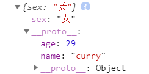

# 一、`ES5`

## 1.1.运行模式

- 运行模式的分类
  - 混杂模式（正常模式）
  - 严格模式`(strict mode)`:在更严格的语法条件下执行
- 严格模式的目的、作用
  - 消除`JavaScript`语法的一些不合、不严谨之处，减少一些怪异行为
  - 消除代码的一些不安全之处，为代码的安全保驾护航
  - 为未来`JavaScript`的新版本做铺垫

- 使用严格模式

```js
'use strict';  //定义在全局或函数的第一个句，若浏览器不支持，只会解析为一条简单语句，不会有副作用
```

- 严格模式语法和行为的改变

  - 必须使用`var`声明变量

  ```js
  'use strict'
  var age = 10; //此时不使用var，会Uncaught ReferenceError: age is not defined
  ```

  - 禁止自定义函数中`this`指向`window`

  ```js
  'use strict';
  function Person(name, age) {
      this.name = name;
      this.age = age;
  }
  Person('kobe', 39); //Uncaught TypeError: Cannot set property 'name' of undefined
  ```

  ```js
  'use strict';
  function Person(name, age) { 
      console.log(this);  //Person {}
      this.name = name;
      this.age = age;
  }
  new Person('kobe', 39); //构造函数的就是实例对象
  //注意：this是在函数调用时确定，不是在函数定义时确定
  ```

  ```js
  'use strict';
  setTimeout(function () {
      console.log(this); //window，函数不是自定义函数
  }, 1000);
  ```

  - 创建`eval`作用域

  ```js
  var name = 'kobe';
  eval('var name = "anverson";console.log(name)'); //anverson
  console.log(name); //anverson
  //此eval没有自己的作用域，会污染全局作用域；会有安全隐患，若eval中是异常代码
  ```

  ```js
  'use strict'
  var name = 'kobe';
  eval('var name = "anverson";console.log(name)');//anverson
  console.log(name); //kobe
  //此时eval有自己的作用域，不会污染全局作用域，排除了可以的安全隐患
  ```

  - 对象不能有重名的属性

  ```js
  var obj = {
      name : 'kobe',
      name : 'weide'
  };
  //此时会有语法警告
  ```

---

## 1.2.`JSON`对象

- `JSON.stringify(obj/arr)`:`js`对象(数组)转`json`对象(数组)
- `JSON.parse(json)`:`json`对象(数组)转`js`对象(数组)

```js
var obj = {
    name : 'kobe',
    age : 39
};
console.log(typeof JSON.stringify(obj)); //string
console.log(typeof JSON.parse(obj)); //object
```

------

## 1.3.`Object`扩展

- `Object.create(prototype, [descriptors])`
  - `prototype`:以指定对象为原型创建新的对象
  - `descriptors`:为新对象指定新的属性，并对新属性进行描述
    - `value`:新属性的值
    - `writable`:标识当前属性值是否是可修改的，默认为false
    - `configurable`:标识当前属性是否可以被删除，默认为false
    - `enumerable`:标识当前属性是否能用`for in`枚举，默认为false

```js
var obj = {name : 'curry', age : 29}
var obj1 = {};
obj1 = Object.create(obj, {
    sex : { //扩展属性
        value : '男',
        writable : true,
        configurable : true,
        enumerable : true
    }
});
obj1.sex = '女';   //修改扩展属性
console.log(obj1); //obj1对象的原型对象是obj
console.log(obj1.sex);//男
```

图为`obj1`对象，其`__proto__`指向`obj1`的原型对象，原型对象是`obj`对象



- `Object.defineProperties(object, descriptors)`:为指定对象定义扩展属性(可多个)
  - `get`：取值，获取当前属性值的回调函数
  - `set`: 存值，监听当前属性值变化时，触发的回调函数，并且实参为变化后的值

```js
var obj2 = {
    firstName : 'curry',
    lastName : 'stephen'
};
//扩展obj2对象的属性
Object.defineProperties(obj2, {
    fullName : { //扩展的属性
        get : function () { //取值
            return this.firstName + '-' + this.lastName
        },
        set : function (data) { //存值
            var names = data.split('-');
            this.firstName = names[0];
            this.lastName = names[1];
        }
    }
});
console.log(obj2.fullName);  //curry-stephen

obj2.firstName = 'tim';
obj2.lastName = 'duncan';
console.log(obj2.fullName); //tim-duncan

obj2.fullName = 'kobe-bryant'; 
console.log(obj2.fullName); //kobe-bryant
```


- 对象本身的两个方法
  - `get propertyName(){}`:获取当前属性值的回调函数
  - `set propertyName(){}`:监听当前属性值的回调函数

```js
var obj = {
    firstName : 'kobe',
    lastName : 'bryant',
    get fullName(){
        return this.firstName + ' ' + this.lastName
    },
    set fullName(data){
        var names = data.split(' ');
        this.firstName = names[0];
        this.lastName = names[1];
    }
};
console.log(obj.fullName);  //kobe bryant

obj.fullName = 'curry stephen';
console.log(obj.fullName);  //curry stephen
```

----

## 1.4.[`Array`](https://developer.mozilla.org/zh-CN/docs/Web/JavaScript/Reference/Global_Objects/Array/unshift)

- `Array.prototype.indexOf(value) `:获取值在数组中的第一个下标
- `Array.prototype.lastIndexOf(value)`:获取值在数组中的最后一个下标
- `Array.prototype.forEach(function(item, index){})`:遍历数组
- `Array.prototype.map(function(item, index){})`:遍历数组并加工每项值，返回一个新数组

```js
var arr1 = arr.map(function (item, index) {
    return item + 10
});
console.log(arr, arr1); //
```

- `Array.prototype.filter(function(item, index){})`:遍历数组过滤出一个新数组，返回过滤条件为`true`的

```js
var arr2 = arr.filter(function (item, index) {
    return item > 4
});
console.log(arr, arr2);
```

---

## 1.5.`Function`扩展

- `Function.prototype.bind(obj)`：将`this`绑定为`obj`对象，并将函数返回

```js
function fun(age) {
    this.name = 'kobe';
    this.age = age;
    console.log(this); //{name: "kobe", age: 12}
}
var obj = {};
console.log(fun.bind(obj));
fun.bind(obj, 12)();  //执行函数，fun.bind(obj, 12)函数定义，12是age的实参
```

> `bind()、call()、apply()`的区别

- 都能指定函数中的`this`
- `call()、apply()`是立即执行函数
- `bind()`是将函数返回，不会立即执行

```js
function fun(age) {
    this.name = 'kobe';
    this.age = age;
    console.log(this);
}

var obj = {};
new fun(12);  //this指向实例对象
fun();        //this指向window
fun.call();   //this指向window
fun.apply();  //this指向window
fun.call(obj, 12, 22);//this指向obj对象，多个参数依次在后面传入
fun.apply(obj,[23,34]);//thsi执行obj对象，参数通过数组传入
```

---

# 二、`ES6`

## 1.1.`let/const/var`

- `let`声明一个变量
  - 在块级作用域有效
  - 不能重复声明
  - 不会预处理；在声明之前访问变量，会抛出`ReferenceError`错误
  - 不存在变量提升
- `const`定义一个常量
  - 不能修改
  - 其余特点同`let`
  - 应用：保存不会改变的数据

- `var`是函数作用域
  - `var`在声明变量之前访问变量，会得到`undefined`


## 1.2.变量的解构赋值

从对象或数组中提取数据，并赋值给多个变量

- 对象的解构赋值

```js
//取对象中对应属性的值
let user = {username: "张三", age: 19, sex: "男"}
let {username, age} = user  
console.log(username,age)  //张三 19

//若属性不存在则为undefined
let {sex,birth} = user
console.log(sex,birth) //男 undefined
```

- 数组的解构赋值

```js
let arr = ['abc', 23, true];
let [a, b, c, d] = arr;
console.log(a, b, c, d);  //abc 23 true undefined
//按顺序取值，若没有值则为undefined

let [,,c] = arr  //取第三个值
consoel.log(c) //true
```

- 用途，多个形参赋值

```js
function print(user){
    console.log(user.username,user.age);
}
let user = {username: "张三", age: 19, sex: "男"}
print(user)  //张三 19
```

```js
//解构赋值
function print({username,age}){
    console.log(username,age);
}
let user = {username: "张三", age: 19, sex: "男"}
print(user)  //张三 19
```

## 1.3.模板字符串

- 简化字符串的拼接

- 模板字符串使用``
- 变化的部分使用`${xxx}`定义

```js
let user = {username : "张三", age : 10}
console.log(`${user.username}今年已经${user.age}岁`);  //张三今年已经10岁
```

## 1.4.简化对象的写法

- 可省略同名属性名
- 省略方法的`funtion`

```js
let x = 3;
let y = 5;
//普通额写法
let obj = {
    x : x,
    y : y,
    getPoint : function () {
        return this.x + this.y
    }
};
```

```js
let x = 3;
let y = 5;
//简写
let obj = {
    x,   //省略同名属性名
    y,
    getPoint(){  //省略function
        return this.x
    }
};
```

## 1.5.箭头函数

- 作用：定义匿名函数

- 基本语法

  - 没有参数，`()`不能省略

  ```js
  () => console.log('=>')
  ```

  - 一个参数，可省略`()`

  ```js
  (x) => x+2
  x => x+2
  ```

  - 两个及两个以上参数

  ```js
  (a,b) => a+b
  ```

- 函数体(右侧)

  - 函数体不使用`{}`时，会默认返回函数体的结果
  - 若函数体有多条语句，必须使用`{}`
  - 函数体使用`{}`，需要返回结果时，要手动返回`return`

  ```js
  let sum = (x, y) => {
      x = x + 2;
      return x + y;
  }
  ```

- 应用：多用于定义回调函数

- 箭头函数的特点
  - 简洁
  - 箭头函数没有自己的`this`，其`this`不是在调用的时候决定的(`function`函数是在调用的时候决定`this`)，而是在定义的时候处在的对象就是它的`this`
  - 扩展理解:箭头函数`this`是看外层是否有函数
    - 有，外层函数的`this`就是箭头函数的`this`
    - 没有，箭头函数的`this`是`window`

```js
let fun = function () {
    console.log('fun()');
};
fun();

//没有形参，并且函数体只有一条语句
let fun1 = () => console.log('fun1()');
fun1();
console.log(fun1());


```

```js
let btn = document.getElementById('btn');
//非箭头函数
btn.onclick = function () {
    console.log(this); //btn元素
};

//箭头函数
let obj = {
    name : 'kobe',
    age : 39,
    getName : function {
        btn.onclick = () => {
            console.log(this); //obj
        };
    }
};

//多个箭头函数
let obj = {
    name : 'kobe',
    age : 39,
    getName : () => {
        btn.onclick = () => {
            console.log(this); //window
        };
    }
};
```

## 1.6.`...`运算符

**rest参数**称为不定参数，用于获取函数的多余参数，用于替代`arguments`

```js
function fun(...values) {
    console.log(values);  //values是一个数组
    values.forEach(function (item, index) {
        console.log(item, index);
    })
}
fun(1,2,3);
```

```js
function fun(a,b,c){
    console.log(arguments); //arguments是一个伪数组，没有forEach等方法
}
fun(1,2,3);
```

- 表示数组的所有值

```js
let arr = [2,3,4,5,6];
let arr1 = ['abc',...arr, 'fg']; //...arr表示数组arr的所有值
console.log(arr1);   //["abc", 2, 3, 4, 5, 6, "fg"]
```

## 1.7.形参默认值

当不传入参数时，默认使用形参的默认值

```js
function Point(x=0, y=0) {
    this.x = x;
    this.y = y;
}
let point = new Point(25, 36);
console.log(point);//(25,36)

let p = new Point();
console.log(p); //默认为坐标原点(0,0)
```

## 1.8.`Promise`


`


回调函数

- 我定义的
- 我没有调用
- 但是最终执行了


# 一、`暂时性死区(TDZ)`

`TDZ(Temporal Dead Zone)`暂时性死区


# 二、`Prosime`


# 三、`async/await`

- `async `表示异步，`await(async wait)`

- `async`用于申明一个`function`时异步的，而`await`用于等待异步方法执行完成
- `await`只能出现在`async`函数中

  