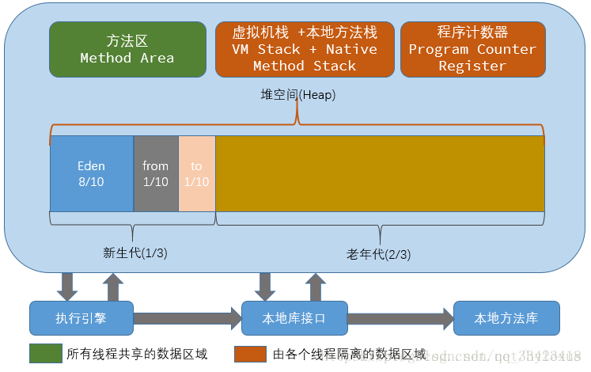
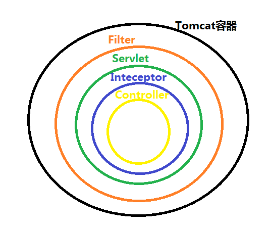

# 一、基础

## 1.1.对象的深浅克隆

### 1.1.1.为什么克隆

克隆的对象可能包含一些修改过的属性，而`new`出的对象属性还是初始状态。

```java
protected native Object clone() throws CloneNotSupportedException;
```

### 1.1.2.浅克隆

- 实现`Clonenable`接口，不实现该接口调用`clone()`方法，会抛出`CloneNotSupportedException`异常
- 重写`clone()`方法，修改范文修饰符为`public`

```java
public class Address {
    private String city;

    public Address(String city) {
        this.city = city;
    }

    public String getCity() {
        return city;
    }

    public Address setCity(String city) {
        this.city = city;
        return this;
    }
}
```

```java
public class User implements Cloneable {

    private String userId;
    private String username;
    private Address address;

    public String getUserId() {
        return userId;
    }

    public User setUserId(String userId) {
        this.userId = userId;
        return this;
    }

    public String getUsername() {
        return username;
    }

    public User setUsername(String username) {
        this.username = username;
        return this;
    }

    public Address getAddress() {
        return address;
    }

    public User setAddress(Address address) {
        this.address = address;
        return this;
    }

    @Override
    public User clone() throws CloneNotSupportedException {
        return (User) super.clone();
    }
}

```

```java
public static void main(String[] args) throws CloneNotSupportedException {
    Address address = new Address("成都");
    User user = new User();
    user.setUserId("u001");
    user.setAddress(address);
    User clone = user.clone();
    System.out.println(user.getAddress().getCity()); //成都
    System.out.println(clone.getAddress().getCity());//成都
    System.out.println(user == clone);

    System.out.println("--------------------------------");
    address.setCity("四川");
    System.out.println(user.getAddress().getCity()); //四川
    System.out.println(clone.getAddress().getCity());//四川

}
```

浅拷贝时：只复制对象本身与其包含的值类型成员变量，引用类型成员变量不复制。

- 若原型对象的成员变量是值类型，就复制一份给克隆对象；
- 若原型对象的成员变量是引用类型，就将引用对象的地址复制一份给克隆对象；即原型对象与克隆对象的指向相同的地址。


### 1.1.3.深克隆

使用序列化和反序列化实现克隆

- 需要实现`Serializable`接口

```java
public class Address implements Serializable {
    private String city;

    public Address(String city) {
        this.city = city;
    }

    public String getCity() {
        return city;
    }

    public Address setCity(String city) {
        this.city = city;
        return this;
    }
}
```

```java
public class User implements Serializable {

    private String userId;
    private String username;
    private Address address;

    public String getUserId() {
        return userId;
    }

    public User setUserId(String userId) {
        this.userId = userId;
        return this;
    }

    public String getUsername() {
        return username;
    }

    public User setUsername(String username) {
        this.username = username;
        return this;
    }

    public Address getAddress() {
        return address;
    }

    public User setAddress(Address address) {
        this.address = address;
        return this;
    }

    @Override
    public User clone() throws CloneNotSupportedException {
        return (User) super.clone();
    }
}
```

```java
public static void main(String[] args) {
    // 将该对象序列化成流,因为写在流里的是对象的一个拷贝，而原对象仍然存在于JVM里面。所以利用这个特性可以实现对象的深拷贝
    ByteArrayOutputStream baos = null;
    ObjectOutputStream oos = null;
    ByteArrayInputStream bais = null;
    ObjectInputStream ois = null;
    try {
        Address address = new Address("成都");
        User user = new User();
        user.setAddress(address);

        //序列化对象
        baos = new ByteArrayOutputStream();
        oos = new ObjectOutputStream(baos);
        oos.writeObject(user);
        //反序列化
        bais = new ByteArrayInputStream(baos.toByteArray());
        ois = new ObjectInputStream(bais);
        User clone = (User) ois.readObject();
        System.out.println(user.getAddress().getCity()); //成都
        System.out.println(clone.getAddress().getCity());//成都

        //修改原型对象的引用类型
        address.setCity("四川");
        System.out.println(user.getAddress().getCity()); //四川
        System.out.println(clone.getAddress().getCity());//成都
    } catch (IOException e) {
        e.printStackTrace();
    } catch (ClassNotFoundException e) {
        e.printStackTrace();
    } finally {
        //释放资源
    }
}
```

深克隆时：无论对象的成员变量是值类型还是引用类型，都会复制一份给克隆对象。

- 原型对象的成员变量是值类型，复制一份给克隆对象；
- 原型对象的成员变量是引用类型，复制一份给克隆对象；


# 二、集合

## 2.1.`LinkedList`与`ArrayList`插入速度比较

| 数据量\插入位置 | 头部             | 中间            | 尾部            |
| --------------- | ---------------- | --------------- | --------------- |
| 万              | LinkedList插入快 | ArrayList插入快 | ArrayList插入快 |
| 十万            | LinkedList插入快 | ArrayList插入快 | ArrayList插入快 |
|                 |                  |                 |                 |

## 2.2.`Java7`与`Java8`中的`HashMap`实现

`JDK7`中采用的数据机构：**数组+链表**，随着数据量的增大，`Hash`碰撞会越来越频繁。即链表会越来越长，查找效率会不断降低。

- 不同`hash`值的`key`的`Entry<K,V>`存在数组`table`中，数组存储
- 每个相同`hash`值的`key`的`Entry<K,V>`存在链表中，链表存储

```java
//存放数据的数组 
transient HashMap.Entry<K, V>[] table;
//HsahMap中值的修改次数
transient int modCount;
```

```java
//Map中的key、value以Entry形式存放在数组中
static class Entry<K,V> implements Map.Entry<K,V> {
        final K key;
        V value;
        Entry<K,V> next;
        int hash;
}
```

而这个`Entry`存放在数组的什么位置（位桶/`hash`桶）上，`hash`值相同的`Entry`会放在同一位置，用链表相连。

```java
//hash指的运算，通过^(异或)运算
public final int hashCode() {
    return Objects.hashCode(getKey()) ^ Objects.hashCode(getValue());
}

final int hash(Object k) {
    int h = hashSeed;
    if (0 != h && k instanceof String) {
        return sun.misc.Hashing.stringHash32((String) k);
    }

    h ^= k.hashCode();
    h ^= (h >>> 20) ^ (h >>> 12);
    return h ^ (h >>> 7) ^ (h >>> 4);
}
```

`hash`值计算出来后，会根据`indexFor`计算出它在数组`table`中的下标。

```java
static int indexFor(int h, int length) {
    return h & (length-1);
}
```

`get(Object key)`方法：

```java
public V get(Object key) {
    //key == null，调用getForNullKey()
    if (key == null)
        return getForNullKey();
    //获取对应key的Entry
    Entry<K,V> entry = getEntry(key);

    return null == entry ? null : entry.getValue();
}

final Entry<K,V> getEntry(Object key) {
    if (size == 0) {
        return null;
    }
	//计算hash值
    int hash = (key == null) ? 0 : hash(key);
    //通过hash值获取table数组的Entry的位置
    //遍历链表Entry的每个元素，获取key对应Entry节点
    for (Entry<K,V> e = table[indexFor(hash, table.length)];
         e != null;
         e = e.next) {
        Object k;
        if (e.hash == hash &&
            ((k = e.key) == key || (key != null && key.equals(k))))
            return e;
    }
    return null;
}
```

`put(K key, V value)`方法：

```java
public V put(K key, V value) {
    if (table == EMPTY_TABLE) {
        inflateTable(threshold);
    }
    //key == null，put空键
    if (key == null)
        return putForNullKey(value);
    //计算hash
    int hash = hash(key);
    //计算数组table下标
    int i = indexFor(hash, table.length);
    //table数组的Entry位置为空，则新建一个Entry<K,V>存入数据
    //table数组的Entry位置不为空，则用链表指向新的Entry<K,V>
    for (Entry<K,V> e = table[i]; e != null; e = e.next) {
        Object k;
        if (e.hash == hash && ((k = e.key) == key || key.equals(k))) {
            V oldValue = e.value;
            e.value = value;
            e.recordAccess(this);
            return oldValue;
        }
    }

    modCount++;
    addEntry(hash, key, value, i);
    return null;
}
```

**`Fail-Fast`机制**

`HashMap`线程不安全，使用迭代器时，多线程修改`map`，`Iterator`通过判断`modCount`（修改次数）是否变化确定有没有修改`Map`，可能会抛出修改异常（`Fail-fast`）

```java
private abstract class HashIterator<E> implements Iterator<E> {
    Entry<K,V> next;        // next entry to return
    //期望修改的次数
    int expectedModCount;   // For fast-fail
    int index;              // current slot
    //当前的Entry
    Entry<K,V> current;     // current entry

    HashIterator() {
        expectedModCount = modCount;
        if (size > 0) { // advance to first entry
            Entry[] t = table;
            while (index < t.length && (next = t[index++]) == null)
                ;
        }
    }

    public final boolean hasNext() {
        return next != null;
    }

    final Entry<K,V> nextEntry() {
        //若修改次数与期望修改次数不一致
        if (modCount != expectedModCount)
            throw new ConcurrentModificationException();
        Entry<K,V> e = next;
        if (e == null)
            throw new NoSuchElementException();

        if ((next = e.next) == null) {
            Entry[] t = table;
            while (index < t.length && (next = t[index++]) == null)
                ;
        }
        current = e;
        return e;
    }

    public void remove() {
        if (current == null)
            throw new IllegalStateException();
        if (modCount != expectedModCount)
            throw new ConcurrentModificationException();
        Object k = current.key;
        current = null;
        HashMap.this.removeEntryForKey(k);
        expectedModCount = modCount;
    }
}
```

`JDK8`中采用的数据结构：**数组+链表/红黑树**，当链表的长度达到某个阈值时，链表就会转换为红黑树。

### 2.2.1.初始容量和负载因子

```java
/**
 * initialCapacity ：初始容量
 * loadFactor ：负载因子
 */
public HashMap(int initialCapacity, float loadFactor) {
    if (initialCapacity < 0)
        throw new IllegalArgumentException("Illegal initial capacity: " +
                                           initialCapacity);
    if (initialCapacity > MAXIMUM_CAPACITY)
        initialCapacity = MAXIMUM_CAPACITY;
    if (loadFactor <= 0 || Float.isNaN(loadFactor))
        throw new IllegalArgumentException("Illegal load factor: " +
                                           loadFactor);
    this.loadFactor = loadFactor;
    this.threshold = tableSizeFor(initialCapacity);
}
```

- `initialCapacity`:初始容量，默认为`1 << 4 = 16`
  - 合适的初始容量，大于**预估元素数量/负载因子**，且是2的幂数
- `loadFactor`：负载因子，容量自动增加之前可以达到多满的一种尺度，默认的加载因子`0.75`(是时间与空间成本的一种折中)
  - 负载因子过高，虽然可减少空间成本，但是会增加查询成本
  - 负载因子过小，则初始容量要增大，否则就会导致频繁扩容

当`HashMap`中的条目数目超出了**初始容量与负载因子乘积**时，则会对`HashMap`扩容，增加大约两倍的桶数。

## 2.3.什么对象能作为`Key`

- 重写过`hashCode()`和`equals()`对象，才能作为`key`；

- `null`可以作为`key`

```java
public class User {
    private String userId;
   	public User(String userId) {
        this.userId = userId;
    }

    public String getUserId() {
        return userId;
    }

    public User setUserId(String userId) {
        this.userId = userId;
        return this;
    }

}
```

```java
@Test
public void test11() {
    Map map = new HashMap();
    map.put(new User("u001"), 1);
    map.put(new User("u002"), 2);
    User u001 = new User("u001"); //此时新建的对象地址变了，不能保证hash()与equals()结果还是一致
    User u002 = new User("u002");
    System.out.println(map.get(u001)); //null
    System.out.println(map.get(u002)); //null
}
```

此时新建的对象地址变了，因为取值或插入时默认调用了`hashCode()`与`equals()`方法，不能保证`hashCode()`与`equals()`结果还是一致，所有取不到原来的值了。

解决方法：重写`hashCode()`与`equals()`方法，就可以保证新创建的对象`hash`值一样。

```java
public class User {
    private String userId;

    public User(String userId) {
        this.userId = userId;
    }

    @Override
    public boolean equals(Object o) {
        if (this == o) return true;
        if (o == null || getClass() != o.getClass()) return false;
        User user = (User) o;
        return Objects.equals(userId, user.userId);
    }

    @Override
    public int hashCode() {
        return Objects.hash(userId);
    }
}
```

```java
  @Test
    public void test11() {
        Map map = new HashMap();
        map.put(new User("u001"), 1);
        map.put(new User("u002"), 2);
        User u001 = new User("u001");
        User u002 = new User("u002");
        System.out.println(map.get(u001)); //1
        System.out.println(map.get(u002)); //2
    }
```


# 三、线程

## 3.1.多线程的实现方式

### 3.1.1.继承`Thread`

```java
public class MyThread extends Thread {

    @Override
    public void run() {
        System.out.println("extends Thread");
    }
}
```

```java
MyThread thread = new MyThread();
thread.start();
```

### 3.1.2.实现`Runnable`接口

```java
public class MyRunnable implements Runnable {
    @Override
    public void run() {
        System.out.println("implements Runnable");
    }
}
```

```java
MyRunnable runnable = new MyRunnable();
Thread thread1 = new Thread(runnable);
thread1.start();
```

### 3.1.3.使用`ExecutorService`

```java
public class MyCallable implements Callable {

    private int taskNum;

    public MyCallable() {
    }

    public MyCallable(int taskNum) {
        this.taskNum = taskNum;
    }

    @Override
    public Object call() throws Exception {
        Thread.sleep(1000);
        return new User("u00" + taskNum);
    }
}
```

```java
//有返回值的任务
int taskSize = 5;
//创建线程池
ExecutorService executor = Executors.newFixedThreadPool(taskSize);
//创建多个有返回值的任务
ArrayList<Future> futures = new ArrayList<>();
for (int i = 0; i < taskSize; i++) {
    MyCallable callable = new MyCallable(i);
    //执行任务，返回future
    Future future = executor.submit(callable);
    futures.add(future);
}
//关闭线程池
executor.shutdown();
//获取所有并发任务返回的结果
for (Future f : futures) {
    //线程的返回值
    Object o = f.get();
    System.out.println(o);
}
```

## 3.2.线程的状态转化


### 3.2.1.线程的状态

- 新建状态`(New)`:新建一个线程对象。
- 就绪状态`(Runnable)`:线程`start()`后，已位于**可运行线程池**中，变为可运行，只等待获取CPU的使用权。即在就绪状态的进程除CPU之外，其它的运行所需资源都已全部获得。
- 运行状态`(Running)`:就绪状态的线程获取了CPU，执行程序代码。
- 阻塞状态`(Blocked)`:阻塞状态是线程因为某种原因放弃CPU使用权，暂时停止运行。直到线程进入就绪状态，才有机会转到运行状态。阻塞分三种情况：
  - 等待阻塞：运行的线程执行`wait()`方法，该线程会释放占用的所有资源，`JVM`会把该线程放入**等待池**中；进入这个状态后，是不能自动唤醒的，必须依靠其他线程调用`notify()`或`notifyAll()`方法才能被唤醒。
  - 同步阻塞：运行的线程在获取对象的同步锁时，若该同步锁被别的线程占用，则JVM会把该线程放入**锁池**中。
  - 其它阻塞：运行的线程执行`sleep()`或`join()`方法，或者发出了I/O请求时，JVM会把该线程置为阻塞状态；sleep()状态超时、join()等待线程终止或者超时、或者I/O处理完毕时，线程重新转入就绪状态。
- 死亡状态`(Dead)`：线程执行完了或者因异常退出了run()方法，该线程结束生命周期。


## 3.3.如何停止一个线程

停止一个线程意味着在任务处理完任务之前停掉正在做的操作，也就是放弃当前的操作。

- `Thread.stop()`可以停止一个正在运行的线程，但是该方法不安全，已废弃，不建议使用。
- 使用退出标志
- `interrupt()`中断线程，`interrupt()`是在当前线程中打了一个停止标志，并不是真正的停止线程。


### 3.3.1.判断线程是否是停止状态

- `Thread.interrupted()`:测试当前线程是否已经中断，指运行`Thread.interrupted()`方法的线程。
  - 该方法会清除掉中断状态。

```java
MyRunnable runnable = new MyRunnable();
Thread thread = new Thread(runnable);
thread.start();
thread.interrupt();//中断线程thread
System.out.println(Thread.interrupted());//false 获取当前线程(主线程)的状态
System.out.println(Thread.interrupted());//false
```

```java
MyRunnable runnable = new MyRunnable();
Thread thread = new Thread(runnable);
thread.start();
Thread.currentThread().interrupt();//中断当前运行的线程（主线程）
System.out.println(Thread.interrupted());//true Thread.interrupted()会清除掉中断状态
System.out.println(Thread.interrupted());//false
```

- `thread.isInterrupted()`:测试线程是否已经中断
  - 不会清除中断状态

```java
MyRunnable runnable = new MyRunnable();
Thread thread = new Thread(runnable);
thread.start();
thread.interrupt();//中断线程
System.out.println(thread.isInterrupted()); //true
System.out.println(thread.isInterrupted()); //true
```


## 3.4.什么是线程安全


## 3.5.如何保证线程安全


## 3.6.`synchronized`如何使用


## 3.7.`synchronized`与`lock`的区别


## 3.8.多线程如何进行信息交互


## 3.9.`sleep()`和`wait()`的区别


# 四、`JVM`

## 4.1.什么时候触发`gc()`

- 执行`system.gc()`的时候

  


## 4.2.内存泄漏`(memory leak)`

程序申请内存后，无法释放已申请的内存空间的情况。一次内存泄漏的危害可忽略，但内存泄漏堆积的后果就很严重，无论多少内存，都可能被占光。内存泄漏最终会导致内存溢出。

内存泄漏的原因：对象无法被`GC`回收。


## 4.3.内存溢出`(out of memory)`

程序申请内存时，没有足够的内存空间供其使用，导致不能存放下数据的情况。

内存溢出的原因：

- `JVM`内存过小
- 程序不严谨，在内存中产生了过多的垃圾

造成内存溢出情况：

- 内存泄漏的堆积导致了内存溢出；
- 内存中加载的数据过于庞大，如一次从数据库拉取了过多的数据；
- 集合类中有对象的引用，使用完成后未清空，是`GC`不能回收；
- 代码中存在死循环或者在循环中产生了过多的对象实体；
- 使用了第三方软件中存在`bug`；
- 启动的内存参数值设置过小；

解决方案：


### 4.3.1.内存泄漏与内存溢出的关系

相同点：都会导致程序运行出现问题，性能下降或挂起。

不同点:

- 内存泄漏是导致内存溢出的原因之一，内存泄漏的堆积可能会导致内存溢出。
- 内存泄漏可通过完善代码来避免，内存溢出可通过调整配置来减少发生的频率，但是无法完全避免。

[^1]: https://www.ibm.com/developerworks/cn/java/l-JavaMemoryLeak/


## 4.4.垃圾回收机制`(GC)`

`GC`的作用：释放内存中不可达到的对象。不可到达指堆内存中的对象没有栈内存的值指向它。

堆内存：存放创建对象的内存；

栈内存：存放指向对象的引用和普通数据类型`(int、float)`。

`System.gc()`方法只是建议虚拟机进行内存回收，并不会一定触发`GC`。

### 4.4.1.如何判断对象可回收?

- **引用计数法`(Referebce Counting)`**：给对象添加一个计数器，每当对象增加一个引用，计数器就加`1`，删除一个引用，计数器就减`1`，当数值为`0`时表示对象没有被引用了。
  - 优点：实现简单，判断效率高；
  - 缺点：很难解决相互引用问题(A对象引用B对象，而B对象引用A对象，除此没有其他对象引用，此时A和B对象都不能被访问到，但是计数器的值不为`0`)
- **可达性分析算法**：通过一系列称为`GC root`的对象作为起点，从这些节点开始向下搜索，搜索走过的路径称为引用链，但对象没有引用链能到达时，该对象就不可用了。
  - `GC root`对象包含有：
    - 虚拟机栈(栈帧中的本地变量表)中引用的变量；
    - 方法区中的类类静态属性引用对象；
    - 方法区中常量引用对象；
    - 本地方法栈中`JNI`引用对象。

### 4.4.2.对象引用方式

- 强引用：最广的引用，`Object o = new Object`这个就是强引用，这类引用只要强引用关系存在，对象就不会被回收。
- 软引用`(SoftReference)`：引用一些目前还在用，但不是必须的对象。软引用的对象在发生内存溢出之前，会把这些对象进行二次回收，若回收掉软引用对象后，仍然没有足够的内存空间时，才会抛出内存溢出`OOM`异常。
- 弱引用`(WeakReference)`：引用非必须的对象，比软引用更弱，被若引用管理的对象只能生存到下次`GC`发生之前；就是`gc`运行时会清除掉弱引用。
- 虚引用：最弱的引用，又叫幽灵引用，一个对象是否存在虚引用并不会影响对象被回收，也不能通过虚引用获取对象`(如通过get()获取会返回null)`；虚引用的唯一目的:在对象被`gc`回收时能收到一个系统通知。

### 4.4.3.`gc`触发的条件

- `Minor GC`触发条件:
  - `Eden`区满，即触发`Minor GC`。
- `Full GC`触发条件：
  - 调用`System.gc()`，建议执行
  - 老年代空间不足
  - 方法区（永久代，元空间，`metaspace`）空间不足	
  - 通过`Minor GC`进入老年代大于老年代的大小



- 新生代
  - `eden space`(8)
  - `from space`(1)
  - `to space`(1)

在`MinorGC`时，会把存活的对象复制到`to space`区域，若`to space`区域不够，则利用保机制进入老年代区域。

- 当应用程序空闲时，即没有应用线程运行时，`GC`会调用。因为`GC`在优先级最低的线程中进行，应用忙的时候不会调用，下面情况除外。
- `Java`堆内存不足时，`GC`会调用。当应用线程在运行，并在运行过程中创建新对象，若这时内存空间不足，JVM就会强制地调用GC线程，以便回收内存用于新的分配。若GC一次之后仍不能满足内存分配的要求，JVM会再进行两次GC作进一步的尝试，若仍无法满足要求，则 JVM将报`out of memory`的错误，Java应用将停止。


### 4.4.1.那些内存需要回收


- **程序计数器`(Program Counter Register)`**:


[^1]: https://blog.csdn.net/abc512427549/article/details/79973922
[^2]: <https://blog.csdn.net/d6619309/article/details/53358250>


# 五、`Servlet`

## 5.1.`Servlet`是否线程安全?

`Servlet`是线程不安全的，


## 5.2.过滤器与拦截器的区别？

- `Filter`基于函数回调的；`Interceptor`是基于`Java`反射的
- `Filter`依赖于`Servlet`容器；`Interceptor`不依赖于`Servlet`容器
- `Filter`对几乎所有的请求起作用；`Interceptor`只对`action`请求起作用
- `Filter`不能访问`action`上下文与值栈中的对象；`Interceptor`能访问`action`上下文与值栈中的对象
- 在`action`的生命周期中，`Filter`只会在容器初始化时调用一次；而`Interceptor`可以多次调用
- `Interceptor`可以获取`IOC`容器中各个`bean`，故在拦截器里注入一个`service`，可以调用业务逻辑；而`Filter`不能

### 5.2.1.触发时机

`Filter`在请求进入容器后，但请求没有进入`Servlet`之前进行预处理；在请求结束后返回，是在`Servlet`处理完成后，返回给前端之前。


